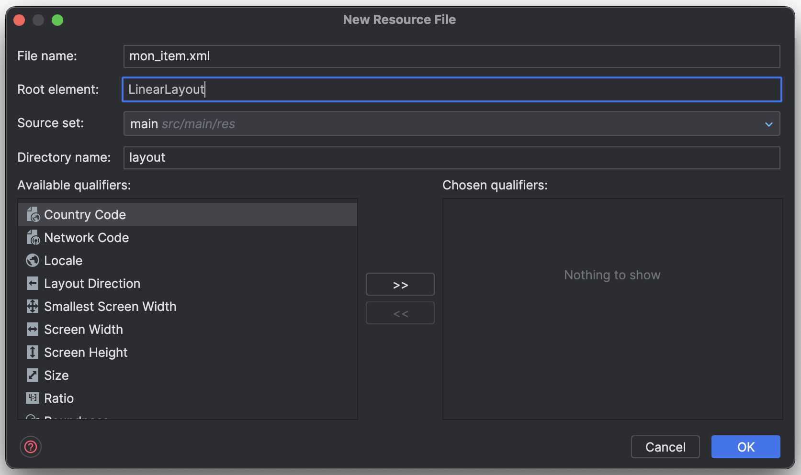
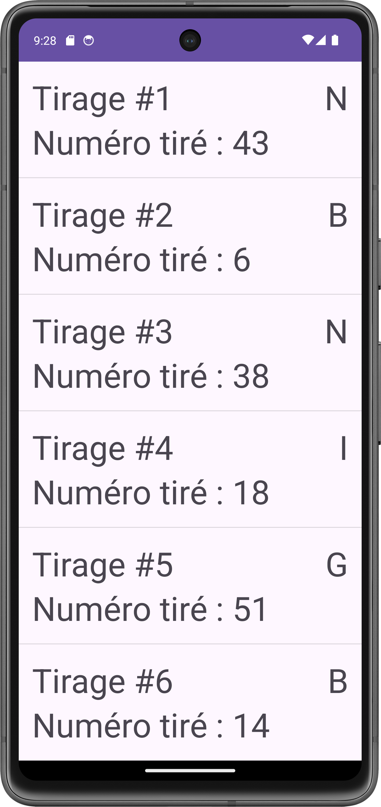
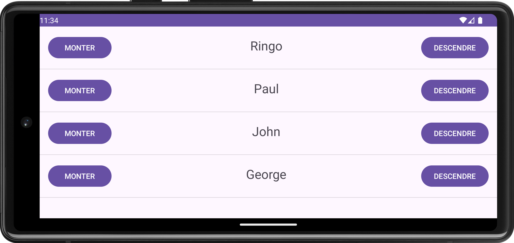
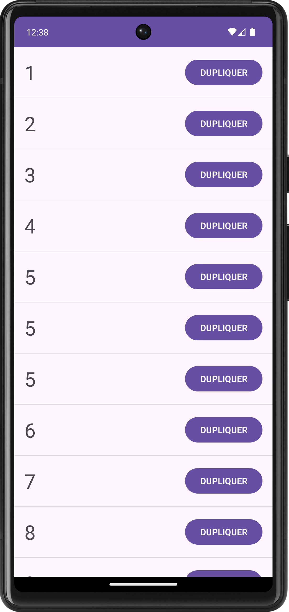

# Android : listes avec RecyclerView

TODO:

- produire une recette pour inclure un recyclerview dans une activité existante
  - librairies nécessaires dans build.gradle
  - Ajout du recycler view dans le layout
  - Adapter de base pour juste mettre le toString de l'objet
  - Raffiner le layout
  - Réagir dans l'adapter, obtenir un contexte / naviguer
- une video d'explication du "recycler" dans RecyclerView (plus courte)
  - différence entre create et bind
  - explication avec points d'arret puis ensuite avec trace
- valider la recette en l'appliquant à un projet existant

<Row>

<Column>

:::danger Avant la séance (2h)

- Vous devez regarder les vidéos
- Ensuite, commencez les exercices. Arrêtez-vous quand vous avez complété 2 heures.

<Video url="https://youtu.be/nkGseYC3QAw" />

[Code après video 1](https://github.com/departement-info-cem/3N5-Prog3/tree/main/code/recyclerview)

<Video url="https://youtu.be/gtHix80YUx0" />

[Code après video 2](https://github.com/departement-info-cem/3N5-Prog3/tree/main/code/RecyclerView-Deboguage)

:::

</Column>

<Column>

:::info À faire pendant la séance

Compléter les exercices de la semaine. Continuer le travail pratique.

:::

</Column>

</Row>

:::tip Recette RecyclerView de String

Étapes de mise en place d'un `RecyclerView` qui gère une liste de `String` sur un projet existant.

Le code de cette recette est disponible [ici](https://github.com/departement-info-cem/3N5-Prog3/tree/a24-kotlin/code/RecetteRecyclerView).

TODO : Mettre à jour le lien vers le code après avoir mergé la branche a24-kotlin

<Tabs queryString="recette-string">
  <TabItem value="build.gradle.kts" label="build.gradle.kts">

    Nous allons utiliser le [ViewBinding](https://developer.android.com/topic/libraries/view-binding#kts) pour la suite des choses. Assurez vous qu'il est activé dans votre fichier `build.gradle.kts`.

    ```kotlin
    android {
      ...
      buildFeatures {
        viewBinding = true
      }
    }
    ```

  </TabItem>
  <TabItem value="mon_item.xml" label="mon_item.xml">
    L'interface graphique de chaque item à afficher dans la liste est définie dans un fichier `xml`, comme c'est le cas pour les fichiers `xml` qui sont utilisés pour définir l'interface graphique.

    <Row>

    <Column size="7" >

    Dans l'explorateur de projet, créez un nouveau fichier `Layout Resource File` dans le dossier `res/layout`.

    

    </Column>

    <Column size="5" >

    Nommez le fichier `mon_item.xml`. Dans `Root element`, choisissez `LinearLayout`.

    
    
    </Column>

    </Row>

    Il faudra personnaliser votre fichier en fonction de ce que vous voulez afficher sur chaque élément de liste. 
    
    - Assignez des `id` aux éléments avec lesquels vous allez interagir.
    - Attention à la hauteur de chaque élément. Ils doivent tous avoir une hauteur fixe ou une hauteur définie en fonction de leur contenu (`wrap_content`).

    Voici un exemple de fichier `mon_item.xml` si on souhaite afficher une `String` dans un `TextView` :

    ```xml
    <?xml version="1.0" encoding="utf-8"?>
    <LinearLayout xmlns:android="http://schemas.android.com/apk/res/android"
        android:layout_width="match_parent"
        android:layout_height="wrap_content"
        android:orientation="horizontal"
        android:padding="16dp">

        <TextView
            android:id="@+id/tvElement"
            android:layout_width="wrap_content"
            android:layout_height="wrap_content"
            android:layout_gravity="center"
            android:text="Salut Salut!"
            android:textSize="24sp" />
    </LinearLayout>
    ```
  </TabItem>
  <TabItem value="MonAdapter.kt" label="MonAdapter.kt">

    Vous allez créer une classe qui est responsable de la gestion de **TOUT** les éléments de la liste et de leur mise à jour.
    En Android, ce type est classe est appelée un **[Adapter](https://developer.android.com/reference/kotlin/android/widget/Adapter)**. 

    Créez une nouvelle classe `MonAdapter.kt` dans un package `adapters` de votre projet.
    
    

    <details>
      <summary>ViewHolder</summary>

      Dans la classe `MonAdapter`, vous devez définir une classe interne, qui sera responsable de gérer le contenu affiché dans **UN SEUL** élément de la liste.
      Cette classe est appelée un **[ViewHolder](https://developer.android.com/reference/kotlin/androidx/recyclerview/widget/RecyclerView.ViewHolder)**.
      Cette classe ressemble en quelque sorte à une classe d'**Activité**.
      
      ```kotlin
      class MonAdapter {

        // binding nous permet d'accéder à tout le champs de notre layout mon_item.xml
        inner class MonItemViewHolder(private val binding: MonItemBinding) : RecyclerView.ViewHolder(binding.root) {
            fun bind(item: String) {
                binding.tvElement.text = item // On affiche l'élément dans le TextView
            }
        }
      }
      ```
    </details>

    <details>
      <summary>DiffCallback</summary>

      Pour que l'`Adapter` sache quels éléments d'une liste doivent être affichés lorsqu'on la modifie, on doit définir un objet qui implémente la classe abstraite **[DiffUtil.ItemCallback](https://developer.android.com/reference/androidx/recyclerview/widget/DiffUtil.ItemCallback)**.

      Nous vous recommandons de définir cet objet dans le même fichier que votre `Adapter`, mais à l'extérieur de la classe `MonItemAdapter`.

      ```kotlin
      class MonItemAdapter {
          // ...
      }

      object MonItemDiffCallback : DiffUtil.ItemCallback<String>() {
          override fun areItemsTheSame(oldItem: String, newItem: String): Boolean {
              return oldItem == newItem
          }

          override fun areContentsTheSame(oldItem: String, newItem: String): Boolean {
              return oldItem == newItem
          }
      }
      ```
    </details>

    <details>
      <summary>ListAdapter</summary>

      Afin d'accéder aux outils de gestion de liste fournis par Android, vous devez étendre la classe **[ListAdapter](https://developer.android.com/reference/androidx/recyclerview/widget/ListAdapter)**.

      La classe a besoin du **ViewHolder** et du **DiffCallback** que vous avez défini précédemment.

      ```kotlin
      class MonAdapter : ListAdapter<String, MonAdapter.MonItemViewHolder>(MonItemDiffCallback) {
          // ...
      }
      ```

      À ce point ci, votre environnement de développement devrait vous indiquer des erreurs. 
      C'est normal, car vous n'avez pas encore implémenté les méthodes requises par la classe ListAdapter.

      Pour corriger cette erreur, vous pouvez placer votre curseur sur l'erreur, et cliquer sur "Implement members", qui va générer les méthodes.
      Dans la prochaine étape, nous allons remplir ces méthodes.

      
    </details>

    <details>
      <summary>onCreateViewHolder</summary>

      La méthode `onCreateViewHolder` est appelée lorsqu'un nouvel élément de la liste doit être affiché.

      ```kotlin
      override fun onCreateViewHolder(parent: ViewGroup, viewType: Int): MonItemViewHolder {
        val binding: MonItemBinding = MonItemBinding.inflate(LayoutInflater.from(parent.context), parent, false)
        return MonItemViewHolder(binding)
      }
      ```
    </details>

    <details>
      <summary>onBindViewHolder</summary>

      La méthode `onBindViewHolder` est appelée lorsqu'un élément de la liste doit être mis à jour.

      ```kotlin
      override fun onBindViewHolder(holder: MonItemViewHolder, position: Int) {
        holder.bind(getItem(position))
      }
      ```
    </details>

    <details>
      <summary>Résultat</summary>
    
      Votre fichier MonAdapter.kt devrait maintenant ressembler à ceci :

      ```kotlin
      class MonAdapter : ListAdapter<String, MonAdapter.MonItemViewHolder>(MonItemDiffCallback) {

        // binding nous permet d'accéder à tout le champs de notre layout mon_item.xml
        inner class MonItemViewHolder(private val binding: MonItemBinding) : RecyclerView.ViewHolder(binding.root) {
          fun bind(item: String) {
            binding.tvElement.text = item // On affiche l'élément dans le TextView
          }
        }

        override fun onCreateViewHolder(parent: ViewGroup, viewType: Int): MonItemViewHolder {
          val binding: MonItemBinding = MonItemBinding.inflate(LayoutInflater.from(parent.context), parent, false)
          return MonItemViewHolder(binding)
        }

        override fun onBindViewHolder(holder: MonItemViewHolder, position: Int) {
          val item: String = getItem(position)
          holder.bind(item)
        }

      }

      object MonItemDiffCallback : DiffUtil.ItemCallback<String>() {
        override fun areItemsTheSame(oldItem: String, newItem: String): Boolean {
          return oldItem == newItem
        }

        override fun areContentsTheSame(oldItem: String, newItem: String): Boolean {
          return oldItem == newItem
        }
      }
      ```
    </details>

  </TabItem>
  <TabItem value="ActivityMain.xml" label="ActivityMain.xml">

  On ajoute le `RecyclerView` dans le fichier `xml` de l'activité.
    
  ```xml
  <?xml version="1.0" encoding="utf-8"?>
  <LinearLayout xmlns:android="http://schemas.android.com/apk/res/android"
    xmlns:app="http://schemas.android.com/apk/res-auto"
    xmlns:tools="http://schemas.android.com/tools"
    android:id="@+id/main"
    android:layout_width="match_parent"
    android:layout_height="match_parent"
    tools:context=".MainActivity">

    <androidx.recyclerview.widget.RecyclerView
      android:id="@+id/rvMonAdapter"
      android:layout_width="match_parent"
      android:layout_height="match_parent"
      app:layoutManager="androidx.recyclerview.widget.LinearLayoutManager"
      app:spanCount="1"
      tools:listitem="@layout/mon_item" />
  </LinearLayout>
  ```

  </TabItem>
  <TabItem value="MainActivity.kt" label="MainActivity.kt">

    <details>
      <summary>ViewBinding</summary>

      Commencez par mettre en place le ViewBinding dans votre activité.

      ```kotlin
      class MainActivity : AppCompatActivity() {

        private lateinit var binding: ActivityMainBinding

        override fun onCreate(savedInstanceState: Bundle?) {
          super.onCreate(savedInstanceState)
          binding = ActivityMainBinding.inflate(layoutInflater)
          setContentView(binding.root)
        }
      }
      ```
    </details>

    <details>
      <summary>Configurer le RecyclerView</summary>

      Créez une méthode pour lier l'`Adapteur` que nous venons de créer au `RecyclerView`.

      ```kotlin
      class MainActivity : AppCompatActivity() {

        private lateinit var binding: ActivityMainBinding
        private lateinit var adapter: MonAdapter

        override fun onCreate(savedInstanceState: Bundle?) {
          // ...

          setupRecycler()
        }

        private fun setupRecycler() {
          adapter = MonAdapter() // Créer l'adapteur
          binding.rvMonAdapter.adapter = adapter // Assigner l'adapteur au RecyclerView
          binding.rvMonAdapter.setHasFixedSize(true) // Option pour améliorer les performances
          binding.rvMonAdapter.addItemDecoration( // Ajouter un séparateur entre chaque élément
            DividerItemDecoration(
              binding.rvMonAdapter.context, DividerItemDecoration.VERTICAL
            )
          )
        }
      }
      ```
    </details>

    <details>
      <summary>Remplir le RecyclerView</summary>

      Remplissez le recycler view avec 10 000 éléments.

      ```kotlin
      class MainActivity : AppCompatActivity() {

        private lateinit var binding: ActivityMainBinding
        private lateinit var adapter: MonAdapter

        override fun onCreate(savedInstanceState: Bundle?) {
          super.onCreate(savedInstanceState)
          binding = ActivityMainBinding.inflate(layoutInflater)
          setContentView(binding.root)

          setupRecycler()
          fillRecycler()
        }

        // ...

        private fun fillRecycler() {
          val items: MutableList<String> = mutableListOf()
          for (i in 1..10000) {
              items.add("Item #$i")
          }
          adapter.submitList(items) // Pour changer le contenu de la liste, utiliser submitList de l'adapteur
        }
      }
      ```

    </details>

  </TabItem>
  <TabItem value="problemes-frequents" label="Problèmes fréquents">

    <details>
      <summary>Je ne vois qu'un seul élément dans ma liste</summary>
    
      <Row>
        <Column size="3" >
          
        </Column>
      </Row>

      <details>
        <summary>Solution</summary>
        <div>
          Si vous ne voyez qu'un seul élément dans votre liste, c'est probablement parce que la hauteur de chaque élément est définie à `match_parent`. Cela signifie que chaque élément de la liste aura une hauteur égale à la hauteur de son contenu. 
          Assurez-vous que la hauteur de chaque élément est définie dans le fichier `xml` de l'élément.
        </div>
      </details>
    </details>
  </TabItem>
</Tabs>

:::

:::note Exercices

##### Avant de commencer 🤔

Les exercices Albums Favoris sont itératifs : à chaque exercices, vous allez commencer à partir de la fin du précédent. Lorsque vous commencez un exercice, nous vous recommandons d'effectuer une copie du dernier projet pour garder une trace de votre avancement. Cela pourrait vous servir lors des examens ou des travaux pratiques!

### Exercice Albums Favoris : Base

<Row>

<Column size="9" >

Vous devez implémenter un RecyclerView simple, où chaque entrée de la liste est une `String` qui représente l'un de vos albums favoris. Chaque entrée de la liste a une hauteur de 150dp.

</Column>
<Column size="3" >


</Column>

</Row>

### Exercice Albums Favoris : Champs d'une classe

<Row>

<Column size="9" >

Chaque entrée de la liste affiche les différents champs d'une classe `Album`.

Voici la classe `Album` :

```kotlin
data class Album(
    val id: Int,
    val name: String,
    val artistName: String,
)
```

</Column>
<Column size="3" >


</Column>

</Row>

### Exercice Albums Favoris : Page de détails

<Row>

<Column size="9" >

Lorsqu'on clique sur un élément de la liste, on doit ouvrir une activitée de détail liée à l'entrée cliquée. La page de détail doit afficher les mêmes champs qui sont affichés dans la liste.

</Column>
<Column size="3" >


</Column>
</Row>

### Exercice Albums Favoris : Supprimer

<Row>

<Column size="9" >

Chaque élément de la liste possède un bouton "Supprimer" qui permet de supprimer l'entrée de la liste.

</Column>
<Column size="3" >


</Column>
</Row>

### (Optionnel 💪) Exercice Albums Favoris : Finition

<Row>

<Column size="6" >

Pour chaque élément de la liste, et dans la page de détails, affichez l'image d'un album à partir d'une URL. Nous vous recommandons d'utiliser la librairie [Picasso](https://square.github.io/picasso/) pour vous aider.

Voici la classe `Album` mise à jour :

```kotlin
data class Album(
    val id: Int,
    val name: String,
    val artistName: String,
    val coverUrl: String,
)
```

Ajoutez un séparateur entre chaque élément de la liste.

</Column>
<Column size="3" >


</Column>
<Column size="3" >


</Column>
</Row>

### (Optionnel Avancé 💪) Exercice Albums Favoris : Supprimer en glissant

<Row>

<Column size="6" >

Faites en sorte qu'on soit capable de supprimer un élément de la liste en le glissant vers la droite ou vers la gauche.

</Column>
<Column size="3" >

On commence à glisser de gauche à droite.


</Column>
<Column size="3" >

On a terminé de glisser, l'item a été supprimé.


</Column>
</Row>

### Exercice Bingo

<Row>

<Column size="9">

Vous devez implanter une liste qui sera affichée sur les téléphones des participants d'un jeu de Bingo.

Chaque élément de la liste doit avoir :

- Le no de tirage (combien de boules ont été tirées, on commence à 1)
- Le numéro tiré (aléatoire entre 1 et 75)
- La lettre du mot BINGO correspondant au chiffre (B : 1 à 15, I : 16 à 30, N : 31 à 45, G : 46 à 60, O : 61 à 75)

Pour les pros de l'algorithmie 💪 : faites en sorte que chaque boule n'apparaisse qu'une seule fois dans la liste.

</Column>

<Column size="3" >



</Column>

</Row>

### Exercice OrdreAlpha

<Row>

<Column size="6" >

- Vous devez implanter un jeu où une liste de prénoms est classée dans un ordre aléatoire.
- Chaque élément a 2 boutons qui permettent de changer l’ordre dans la liste.
- Le joueur gagne dès que la liste est dans l’ordre alphabétique. Dans ce cas :
  - On affiche un dialogue de félicitations
  - On mélange la liste à nouveau.

</Column>

<Column size="6">



</Column>

</Row>

### Exercice duplicata

<Row>

<Column size="9" >

- Une liste avec les nombres entiers de 1 à 10
- Chaque fois qu'on appuie sur un item, il se dédouble.

</Column>

<Column size="3">



</Column>

</Row>

:::
