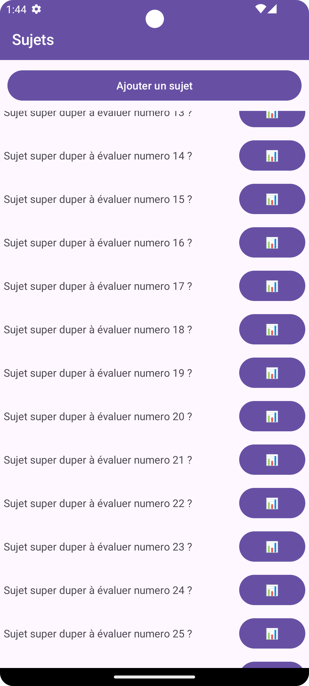
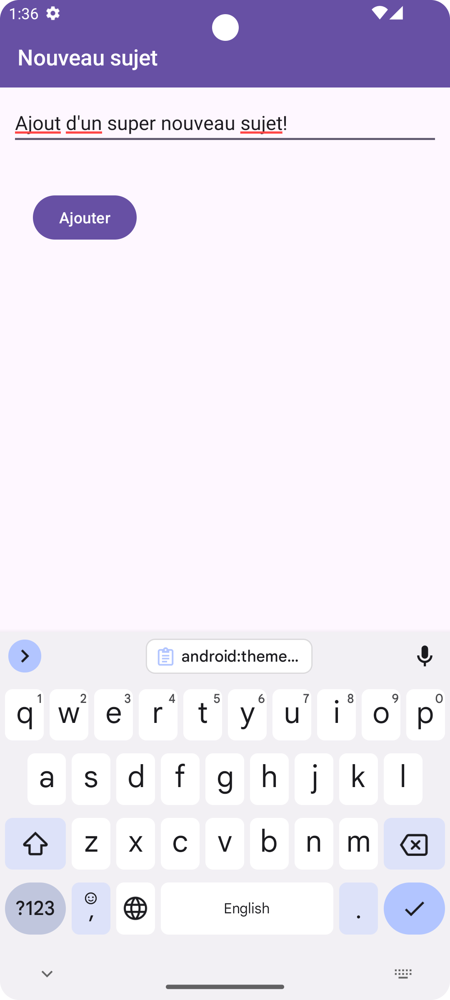
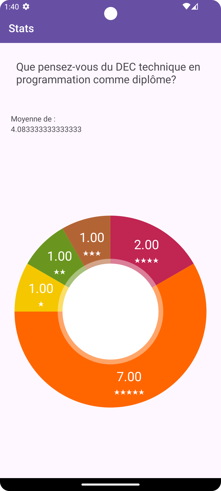

# Travail 2 : Interface graphique Android

<Row>

<Column>

## Git et suivi du code

<Highlight color="tip">1 point</Highlight> Un minimum de 8 commits de tailles comparables (il n'y a pas un commit avec tout dedans et les autres vides) décrivant l'avancement du projet dans un français correct (passe Word).

</Column>

<Column>

## But du travail

Ce TP se concentre sur l'interface graphique :
- les ajouts ne fonctionnent pas, 
- la liste est toujours la même, 
- on voit toujours le même sujet quand on en sélectionne un.

Le but est de mettre en place les objets graphiques, pas de gérer les données. 
Vous ne devez pas valider les données non plus, ni afficher de messages d'erreur.

</Column>

</Row>

:::info Il y a 4 activités à faire :
- Accueil 
- Création (d'un sujet)
- Écran de vote (d'un sujet)
- Écran de résultats (d'un sujet)

:::

## Activité 1 - Accueil

<Row>

<Column size="9">

### Mise en page

&#8203;<Highlight color="tip">1 point</Highlight> 
La mise en page respecte l'image suivante (titre de l'activité, etc.) :

&#8203;<Highlight color="tip">4 points</Highlight>
Le RecyclerView est fonctionnel et occupe le reste de l'écran (hormis le bouton Ajouter).

&#8203;<Highlight color="tip">1 point</Highlight> 
La mise en page de chaque élément de la liste respecte l'image suivante. Vous devez coder la liste visuelle en utilisant un RecyclerView.

&#8203;<Highlight color="tip">1 point</Highlight>
La liste codée en dur a au moins 100 questions qui sont toutes différentes.

&#8203;<Highlight color="tip">1 point</Highlight> 
Le bouton doit contenir une icône au choix.

### Bouton Ajouter

&#8203;<Highlight color="tip">1 point</Highlight> 
Le bouton Ajouter doit amener à l'activité de création d'un sujet.

### Comportement

&#8203;<Highlight color="tip">2 points</Highlight> 
Un appui sur le bouton avec l'icône amène aux résultats. 
Un appui sur tout autre endroit de la ligne amène à l'écran de vote.

:::tip Astuce

Si tu n'arrive pas à naviguer vers [l'écran de vote](#activité-3---écran-de-vote-dune-question) et de [l'écran des résultats](#activité-4---écran-de-résultats-dune-question) à partir d'un élément de liste, tu peux ajouter des boutons pour t'y rendre directement. Nous pourrons alors au moins te donner des points pour ces activités.

:::

</Column>

<Column size="3">

</Column>

</Row>

## Activité 2 - Création d'une question

<Row>

<Column size="9">

### Mise en page

&#8203;<Highlight color="tip">1 point</Highlight> La mise en page respecte l'image suivante (titre de l'activité, etc.) :

### Fonctionnement correct

&#8203;<Highlight color="tip">1 point</Highlight> On retourne à l'accueil quand on appuie sur le bouton.

:::info À noter

La question n'est pas ajoutée à la liste de questions (autrement dit, ça n'a pas à fonctionner).

:::

</Column>

<Column size="3">

</Column>

</Row>

## Activité 3 - Écran de vote (d'une question)

<Row>

<Column size="9">

&#8203;<Highlight color="tip">1 point</Highlight> La mise en page doit correspondre (titre de l'activité, etc.), avec un moyen d'enregistrer une note de 0, 1, 2, 3, 4 ou 5 étoile(s) et un champ pour entrer le nom du votant. Le groupe d'étoiles doit être centré horizontalement.

&#8203;<Highlight color="tip">1 point</Highlight> On retourne à l'accueil quand on appuie sur le bouton.

</Column>

<Column size="3">

</Column>

</Row>

## Activité 4 - Écran de résultats (d'une question)

<Row>

<Column size="9">

&#8203;<Highlight color="tip">1 point</Highlight>
La mise en page correspond (titre de l'activité, etc.) et permet d'afficher la moyenne.

&#8203;<Highlight color="tip">2 points</Highlight> 
Le graphique permet d'afficher la distribution des notes.

</Column>

<Column size="3">

</Column>

</Row>

## Fonctionnement global

&#8203;<Highlight color="danger">5 points négatifs</Highlight> Fonctionnement correct et sans plantage. Ce pointage fonctionne en négatif. Si l'application fonctionne correctement en tout temps, vous conservez votre note. Dans le cas contraire, vous perdez des points avec un maximum de 5.

- plantage de l'application <Highlight color="danger">-1 point</Highlight>
- interface illisible <Highlight color="danger">-1 point</Highlight>
- information affichée incohérente <Highlight color="danger">-1 point</Highlight>
- autres cas...
