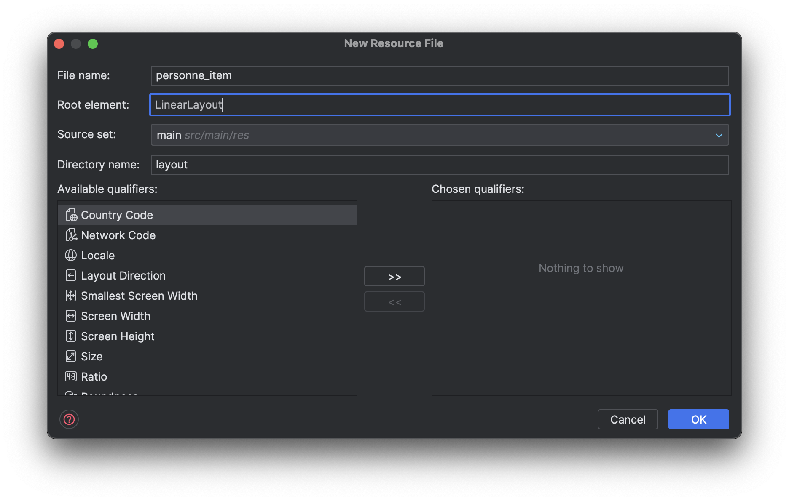
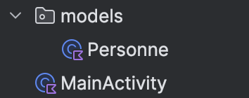
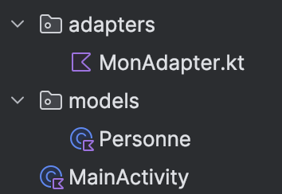
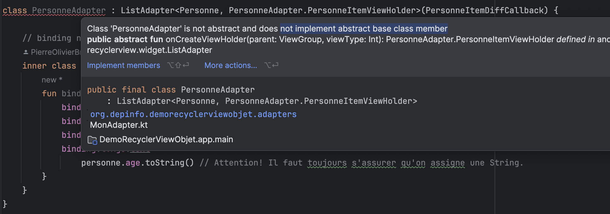

# RecyclerView - Objet

Étapes de mise en place d'un `RecyclerView` qui gère une liste d'objets sur un projet existant.

Le code de cette recette est disponible [ici](https://github.com/departement-info-cem/3N5-Prog3/tree/a24-kotlin/code/DemoRecyclerViewObjet).

La liste que nous allons afficher est une liste de `Personne` :

```kotlin
data class Personne(val nom: String, val prenom: String, val age: Int, val sexe: String)
```

TODO : Mettre à jour le lien vers le code après avoir mergé la branche a24-kotlin

<Tabs queryString="recette-string">
  <TabItem value="build.gradle.kts" label="build.gradle.kts">

    Nous allons utiliser le [ViewBinding](https://developer.android.com/topic/libraries/view-binding#kts) pour la suite des choses. Assurez vous qu'il est activé dans votre fichier `build.gradle.kts`.

    ```kotlin
    android {
      ...
      buildFeatures {
        viewBinding = true
      }
    }
    ```

  </TabItem>
  <TabItem value="mon_item.xml" label="mon_item.xml">
    L'interface graphique de chaque item à afficher dans la liste est définie dans un fichier `xml`, comme c'est le cas pour les fichiers `xml` qui sont utilisés pour définir l'interface graphique.

    <Row>

    <Column size="7" >

    Dans l'explorateur de projet, créez un nouveau fichier `Layout Resource File` dans le dossier `res/layout`.

    

    </Column>

    <Column size="5" >

    Nommez le fichier `personne_item.xml`. Dans `Root element`, choisissez `LinearLayout`.

    

    </Column>

    </Row>

    Il faudra personnaliser votre fichier en fonction de ce que vous voulez afficher sur chaque élément de liste.

    - Assignez des `id` aux éléments avec lesquels vous allez interagir.
    - Attention à la hauteur de chaque élément. Ils doivent tous avoir une hauteur fixe ou une hauteur définie en fonction de leur contenu (`wrap_content`).

    Voici un exemple de fichier `personne_item.xml` si on souhaite afficher les différents champs de la classe `Personne` dans différents `TextView` :

    ```xml
    <?xml version="1.0" encoding="utf-8"?>
    <LinearLayout xmlns:android="http://schemas.android.com/apk/res/android"
        android:layout_width="match_parent"
        android:layout_height="wrap_content"
        android:orientation="vertical"
        android:padding="16dp">

        <LinearLayout
            android:layout_width="match_parent"
            android:layout_height="wrap_content"
            android:orientation="horizontal">

            <TextView
                android:id="@+id/tvPrenom"
                android:layout_width="wrap_content"
                android:layout_height="wrap_content"
                android:layout_gravity="center"
                android:text="Robert"
                android:textSize="24sp" />

            <TextView
                android:id="@+id/tvNom"
                android:layout_width="wrap_content"
                android:layout_height="wrap_content"
                android:layout_gravity="center"
                android:layout_marginLeft="8dp"
                android:text="Charlebois"
                android:textSize="24sp" />
        </LinearLayout>

        <LinearLayout
            android:layout_width="match_parent"
            android:layout_height="wrap_content"
            android:orientation="horizontal">

            <TextView
                android:id="@+id/tvSexe"
                android:layout_width="wrap_content"
                android:layout_height="wrap_content"
                android:layout_gravity="center"
                android:text="Homme"
                android:textColor="#727272"
                android:textSize="16sp" />

            <TextView
                android:layout_width="wrap_content"
                android:layout_height="wrap_content"
                android:layout_gravity="center"
                android:text=","
                android:textColor="#727272"
                android:textSize="16sp" />

            <TextView
                android:id="@+id/tvAge"
                android:layout_width="wrap_content"
                android:layout_height="wrap_content"
                android:layout_gravity="center"
                android:layout_marginLeft="4dp"
                android:text="72"
                android:textColor="#727272"
                android:textSize="16sp" />

            <TextView
                android:layout_width="wrap_content"
                android:layout_height="wrap_content"
                android:layout_gravity="center"
                android:layout_marginLeft="4dp"
                android:text="ans"
                android:textColor="#727272"
                android:textSize="16sp" />
        </LinearLayout>
    </LinearLayout>
    ```

  </TabItem>
  <TabItem value="Personne.kt" label="Personne.kt">
  
      Créez une classe `Personne` dans un package `models` que vous devez aussi créer dans votre projet.
  
      
  
      ```kotlin
      data class Personne(val nom: String, val prenom: String, val age: Int, val sexe: String)
      ```
  </TabItem>
  <TabItem value="PersonneAdapter.kt" label="PersonneAdapter.kt">

    Vous allez créer une classe qui est responsable de la gestion de **TOUT** les éléments de la liste et de leur mise à jour.
    En Android, ce type est classe est appelée un **[Adapter](https://developer.android.com/reference/kotlin/android/widget/Adapter)**.

    Créez une nouvelle classe `PersonneAdapter.kt` dans un package `adapters` que vous devez aussi créer dans votre projet.

    

    <details>
      <summary>ViewHolder</summary>

      Dans la classe `PersonneAdapter`, vous devez définir une classe interne, qui sera responsable de gérer le contenu affiché dans **UN SEUL** élément de la liste.
      Cette classe est appelée un **[ViewHolder](https://developer.android.com/reference/kotlin/androidx/recyclerview/widget/RecyclerView.ViewHolder)**.
      Cette classe ressemble en quelque sorte à une classe d'**Activité**.

      ```kotlin
      class PersonneAdapter {

          // binding nous permet d'accéder à tout le champs de notre layout personne_item.xml
          inner class PersonneItemViewHolder(private val binding: PersonneItemBinding) : RecyclerView.ViewHolder(binding.root) {
              fun bind(personne: Personne) {
                  binding.tvPrenom.text = personne.prenom
                  binding.tvNom.text = personne.nom
                  binding.tvSexe.text = personne.sexe
                  binding.tvAge.text = personne.age.toString() // Attention! Il faut toujours s'assurer qu'on assigne une String.
              }
          }
      }
      ```
    </details>

    <details>
      <summary>DiffCallback</summary>

      Pour que l'`Adapter` sache quels éléments d'une liste doivent être affichés lorsqu'on la modifie, on doit définir un objet qui implémente la classe abstraite **[DiffUtil.ItemCallback](https://developer.android.com/reference/androidx/recyclerview/widget/DiffUtil.ItemCallback)**.

      Nous vous recommandons de définir cet objet dans le même fichier que votre `Adapter`, mais à l'extérieur de la classe `PersonneAdapter`.

      ```kotlin
      class PersonneAdapter {
          // ...
      }

      object PersonneItemDiffCallback : DiffUtil.ItemCallback<Personne>() {
          override fun areItemsTheSame(oldItem: Personne, newItem: Personne): Boolean {
              return oldItem == newItem
          }

          override fun areContentsTheSame(oldItem: Personne, newItem: Personne): Boolean {
              return oldItem.nom == newItem.nom &&
                      oldItem.prenom == newItem.prenom &&
                      oldItem.sexe == newItem.sexe &&
                      oldItem.age == newItem.age
          }
      }
      ```
    </details>

    <details>
      <summary>ListAdapter</summary>

      Afin d'accéder aux outils de gestion de liste fournis par Android, vous devez étendre la classe **[ListAdapter](https://developer.android.com/reference/androidx/recyclerview/widget/ListAdapter)**.

      La classe a besoin du **ViewHolder** et du **DiffCallback** que vous avez défini précédemment.

      ```kotlin
      class PersonneAdapter : ListAdapter<Personne, PersonneAdapter.PersonneItemViewHolder>(PersonneItemDiffCallback) {
          // ...
      }
      ```

      À ce point ci, votre environnement de développement devrait vous indiquer des erreurs.
      C'est normal, car vous n'avez pas encore implémenté les méthodes requises par la classe ListAdapter.

      Pour corriger cette erreur, vous pouvez placer votre curseur sur l'erreur, et cliquer sur "Implement members", qui va générer les méthodes.
      Dans la prochaine étape, nous allons remplir ces méthodes.

      
    </details>

    <details>
      <summary>onCreateViewHolder</summary>

      La méthode `onCreateViewHolder` est appelée lorsqu'un nouvel élément de la liste doit être affiché.

      ```kotlin
      override fun onCreateViewHolder(parent: ViewGroup, viewType: Int): PersonneItemViewHolder {
          val binding: PersonneItemBinding = PersonneItemBinding.inflate(LayoutInflater.from(parent.context), parent, false)
          return PersonneItemViewHolder(binding)
      }
      ```
    </details>

    <details>
      <summary>onBindViewHolder</summary>

      La méthode `onBindViewHolder` est appelée lorsqu'un élément de la liste doit être mis à jour.

      ```kotlin
      override fun onBindViewHolder(holder: PersonneItemViewHolder, position: Int) {
          holder.bind(getItem(position))
      }
      ```
    </details>

    <details>
      <summary>Résultat</summary>

      Votre fichier PersonneAdapter.kt devrait maintenant ressembler à ceci :

      ```kotlin
      class PersonneAdapter : ListAdapter<Personne, PersonneAdapter.PersonneItemViewHolder>(PersonneItemDiffCallback) {

          // binding nous permet d'accéder à tout le champs de notre layout personne_item.xml
          inner class PersonneItemViewHolder(private val binding: PersonneItemBinding) : RecyclerView.ViewHolder(binding.root) {
              fun bind(personne: Personne) {
                  binding.tvPrenom.text = personne.prenom
                  binding.tvNom.text = personne.nom
                  binding.tvSexe.text = personne.sexe
                  binding.tvAge.text =
                      personne.age.toString() // Attention! Il faut toujours s'assurer qu'on assigne une String.
              }
          }

          override fun onCreateViewHolder(parent: ViewGroup, viewType: Int): PersonneItemViewHolder {
              val binding: PersonneItemBinding = PersonneItemBinding.inflate(LayoutInflater.from(parent.context), parent, false)
              return PersonneItemViewHolder(binding)
          }

          override fun onBindViewHolder(holder: PersonneItemViewHolder, position: Int) {
              holder.bind(getItem(position))
          }
      }

      object PersonneItemDiffCallback : DiffUtil.ItemCallback<Personne>() {
          override fun areItemsTheSame(oldItem: Personne, newItem: Personne): Boolean {
              return oldItem == newItem
          }

          override fun areContentsTheSame(oldItem: Personne, newItem: Personne): Boolean {
              return oldItem.nom == newItem.nom &&
                      oldItem.prenom == newItem.prenom &&
                      oldItem.sexe == newItem.sexe &&
                      oldItem.age == newItem.age
          }
      }
      ```
    </details>

  </TabItem>
  <TabItem value="ActivityMain.xml" label="ActivityMain.xml">

On ajoute le `RecyclerView` dans le fichier `xml` de l'activité.

```xml
<?xml version="1.0" encoding="utf-8"?>
<LinearLayout xmlns:android="http://schemas.android.com/apk/res/android"
  xmlns:app="http://schemas.android.com/apk/res-auto"
  xmlns:tools="http://schemas.android.com/tools"
  android:id="@+id/main"
  android:layout_width="match_parent"
  android:layout_height="match_parent"
  tools:context=".MainActivity">

  <androidx.recyclerview.widget.RecyclerView
    android:id="@+id/rvPersonneAdapter"
    android:layout_width="match_parent"
    android:layout_height="match_parent"
    app:layoutManager="androidx.recyclerview.widget.LinearLayoutManager"
    app:spanCount="1"
    tools:listitem="@layout/mon_item" />
</LinearLayout>
```

  </TabItem>
  <TabItem value="MainActivity.kt" label="MainActivity.kt">

    <details>
      <summary>ViewBinding</summary>

      Commencez par mettre en place le ViewBinding dans votre activité.

      ```kotlin
      class MainActivity : AppCompatActivity() {

        private lateinit var binding: ActivityMainBinding

        override fun onCreate(savedInstanceState: Bundle?) {
          super.onCreate(savedInstanceState)
          binding = ActivityMainBinding.inflate(layoutInflater)
          setContentView(binding.root)
        }
      }
      ```
    </details>

    <details>
      <summary>Configurer le RecyclerView</summary>

      Créez une méthode pour lier l'`Adapteur` que nous venons de créer au `RecyclerView`.

      ```kotlin
      class MainActivity : AppCompatActivity() {

        private lateinit var binding: ActivityMainBinding
        private lateinit var adapter: PersonneAdapter

        override fun onCreate(savedInstanceState: Bundle?) {
          // ...

          setupRecycler()
        }

        private fun setupRecycler() {
          adapter = PersonneAdapter() // Créer l'adapteur
          binding.rvPersonneAdapter.adapter = adapter // Assigner l'adapteur au RecyclerView
          binding.rvPersonneAdapter.setHasFixedSize(true) // Option pour améliorer les performances
          binding.rvPersonneAdapter.addItemDecoration( // Ajouter un séparateur entre chaque élément
            DividerItemDecoration(
              binding.rvPersonneAdapter.context, DividerItemDecoration.VERTICAL
            )
          )
        }
      }
      ```
    </details>

    <details>
      <summary>Remplir le RecyclerView</summary>

      Remplissez le recycler view avec 10 000 éléments.

      ```kotlin
      class MainActivity : AppCompatActivity() {

        private lateinit var binding: ActivityMainBinding
        private lateinit var adapter: PersonneAdapter

        override fun onCreate(savedInstanceState: Bundle?) {
          super.onCreate(savedInstanceState)
          binding = ActivityMainBinding.inflate(layoutInflater)
          setContentView(binding.root)

          setupRecycler()
          fillRecycler()
        }

        // ...

        private fun fillRecycler() {
            val items: MutableList<Personne> = mutableListOf()
            for (i in 1..10000) {
                val sexe: String
                if (i % 2 == 0) {
                    sexe = "Homme"
                } else {
                    sexe = "Femme"
                }
                items.add(Personne("Nom $i", "Prenom $i", i, sexe))
            }
            adapter.submitList(items) // Pour changer le contenu de la liste, utiliser submitList de l'adapteur
        }
      }
      ```

    </details>

  </TabItem>
  <TabItem value="problemes-frequents" label="Problèmes fréquents">

    <details>
      <summary>Je ne vois qu'un seul élément dans ma liste</summary>

      <Row>
        <Column size="3" >
          
        </Column>
      </Row>

      <details>
        <summary>Solution</summary>
        <div>
          Si vous ne voyez qu'un seul élément dans votre liste, c'est probablement parce que la hauteur de chaque élément est définie à `match_parent`. Cela signifie que chaque élément de la liste aura une hauteur égale à la hauteur de son contenu.
          Assurez-vous que la hauteur de chaque élément est définie dans le fichier `xml` de l'élément.
        </div>
      </details>
    </details>

  </TabItem>
</Tabs>
