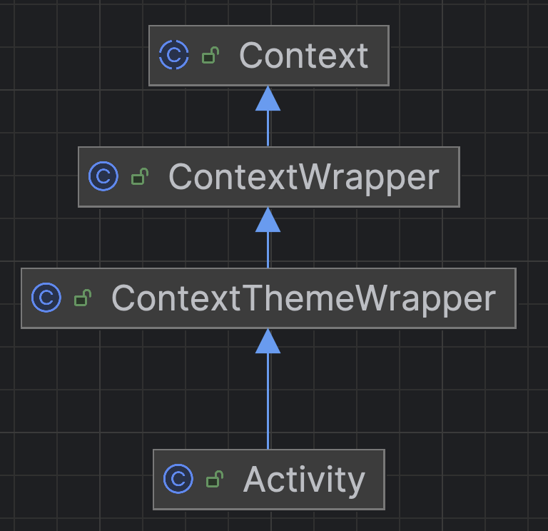

# RecyclerView - Activité

Dans cette recette, nous allons voir comment 

- Réagir à un clic sur un élément d'une liste dans un `RecyclerView`.
- Démarrer une nouvelle activité à partir d'un `ListAdapter`.

TODO : Mettre à jour le lien vers le code après avoir mergé la branche a24-kotlin

Nous allons partir du code de la recette [RecyclerView - String](./recycler-view-string).

Le code de cette recette est disponible [ici](https://github.com/departement-info-cem/3N5-Prog3/tree/a24-kotlin/code/RecetteRecyclerViewContexte).

<Tabs queryString="recette-activite">
    <TabItem value="SecondActivity.kt" label="SecondActivity.kt et activity_second.xml">
        Ajoutez une nouvelle activité dans votre application comme ça a été montré précédement.

        Dans notre cas, nous allons assumer que la nouvelle activité s'appelle `SecondActivity`.
    </TabItem>
    <TabItem value="mon_item.xml" label="mon_item.xml">
        Nous allons ajouter un bouton simple dans notre élément de liste `mon_item.xml` pour pouvoir réagir à un clic sur un élément de la liste.
    
        ```xml
        <?xml version="1.0" encoding="utf-8"?>
        <LinearLayout xmlns:android="http://schemas.android.com/apk/res/android"
            android:layout_width="match_parent"
            android:layout_height="wrap_content"
            android:orientation="horizontal"
            android:padding="16dp">

            <Button
                android:layout_width="wrap_content"
                android:layout_height="wrap_content"
                android:id="@+id/btn_activity"
                android:text="Activité"
                android:layout_marginEnd="16dp"/>

            <TextView
                android:id="@+id/tvElement"
                android:layout_width="wrap_content"
                android:layout_height="wrap_content"
                android:layout_gravity="center"
                android:text="Salut Salut!"
                android:textSize="24sp" />


        </LinearLayout>
        ```

    </TabItem>
    
    <TabItem value="MonAdapteur.kt" label="MonAdapteur.kt">
        Pour réagir à un clic sur le bouton, nous allons ajouter un `OnClickListener` dans la méthode `bind` de la classe interne `MonItemViewHolder`.

        ```kotlin
        class MonAdapter : ListAdapter<String, MonAdapter.MonItemViewHolder>(MonItemDiffCallback) {

            inner class MonItemViewHolder(private val binding: MonItemBinding) :
                RecyclerView.ViewHolder(binding.root) {
                fun bind(item: String) {
                    binding.tvElement.text = item // On affiche l'élément dans le TextView

                    // On ajoute un OnClickListener sur le bouton comme on le ferait dans une Activity
                    binding.btnActivity.setOnClickListener {
                        Intent(binding.root.context, SecondActivity::class.java).apply {
                            // On ajoute le nom de l'élément de liste à l'intent
                            putExtra("monExtra", item)
                            // Démarrer l'activité SecondActivity
                            binding.root.context.startActivity(this)
                        }
                    }
                }
            }

            // Reste du code...
        }

        // Reste du code...
        ```

:::tip Pour les curieux

    <Row>

        <Column size="8">
            La méthode `startActivity` nécessite un `Context` pour être capable de démarrer une nouvelle activité. Alors pourquoi est-ce quand on utilise `startActivity` dans la classe `Activity`, on a pas besoin de spécifier `binding.root.context`?

            C'est parce que la classe `Activity` hérite de la classe `Context`. C'est pour ça qu'on peut utiliser `startActivity` directement dans une `Activity`.

            Voici un schéma de classe pour mieux comprendre :

        </Column>
        <Column size="4">
            
        </Column>

    </Row>


:::

    </TabItem>
</Tabs>