# Rencontre 1 - Accueil

## Introduction

### Les scripts et l'automatisation de tâches

Les scripts et les outils d'automatisation sont un atout considérable en administration réseau. Ils procurent de nombreux avantages, notamment:

- Éliminer les tâches répétitives sans valeur ajoutée
- Exécuter la même tâche sur un grand nombre de machines
- Rentabiliser le temps des équipes TI
- Faire des choses beaucoup plus amusantes et moins routinières!
- Consacrer plus de temps pour l’évolution et l’amélioration continue
- Réduire les risques d’erreurs humaines

### Qu'est-ce qu'une coque logicielle (shell)?

Le shell est l’interface personne-machine d’un système d’exploitation. Il permet à l’utilisateur d’exploiter les fonctionnalités offertes par le système.

Sous Windows, l'interpréteur de commande classique (cmd.exe), l'interface graphique (explorer.exe) et PowerShell constituent les principaux shells. Sous Linux et les autres systèmes basés sur UNIX, le plus connu est bash, mais il en existe aussi plusieurs variantes (sh, csh, ksh, zsh, etc.)

### Qu'est-ce qu'un script d'administration

Contrairement aux langages de programmation comme C++, C# ou Java, les langages de scripts ont généralement ces caractéristiques:
- Centrés sur une tâche précise
- Interprétés (ne nécessitent pas de compilation)
- Ne possèdent pas d’interface graphique
- Utilisent des commandes ou des librairies du système
- Mais possèdent tout de même des structures de contrôle

Souvent, les scripts d'administration sont liés à un shell. Ils exploitent les commandes de celui-ci d’une manière programmatique.

### Principaux langages de script sous Windows

- DOS Batch (.bat, .cmd)
- PowerShell (.ps1)
- VBScript (.vbs, .wsf)
- Python (.py)
- KiXtart (.kix)
- JavaScript (.js, .wsf)

### L'invite de commande Windows

Le shell textuel principal de Windows est l'invite de commande (command prompt en anglais). Son interpréteur est situé dans les fichiers système de Windows:

	C:\Windows\System32\cmd.exe

On peut le lancer par le menu Démarrer, ou simplement en lançant la commande "cmd".

La console démarre avec un invite qui indique le répertoire de travail (le répertoire dans lequel on se trouve). On peut lancer des commandes, une à la fois. Lorsque les commandes interagissent avec le système de fichiers, elles sont relatives au chemin de travail, à moins de spécifier un chemin spécifique en argument.

## Windows PowerShell

PowerShell est à la fois un langage de script et un interpréteur de commandes (à l'instar de l'interpréteur classique, cmd.exe).

Non seulement PowerShell permet le développement de scripts, il est également optimisé pour la ligne de commande. Sans même écrire un fichier de script, on peut faire à la ligne de commande ce qui aurait autrement nécessité un script dans plusieurs autres shells.

### Commandes PowerShell (cmdlets)

Dans la plupart des interpréteurs (cmd, bash, etc.), la très grande majorité des commandes qu'on emploie à la ligne de commande ou par script sont essentiellement des exécutables qui se trouvent dans un répertoire spécial. Lorsqu'on utilise des commandes comme Ping ou Ipconfig dans la console, cela ne fait que lancer l'exécutable ping.exe ou ipconfig.exe qui se trouvent dans C:\Windows\system32\ et afficher le texte qui en résulte dans la console.

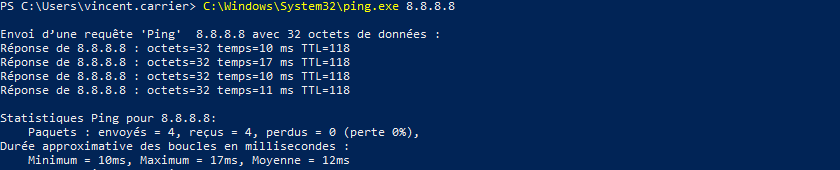

Les données en format textuel sont particulièrement difficiles à interpréter, en supposant par exemple qu'on veuille en extraire certaines valeurs. 

PowerShell fonctionne différemment. En PowerShell, une commande "native" est appelée "cmdlet" et retournent des objets plutôt que du texte. Cela procure plusieurs avantages.

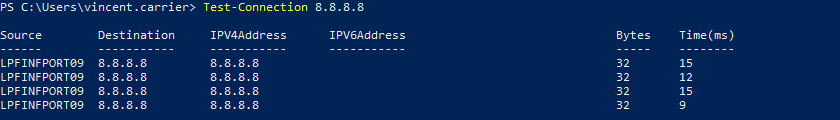

Ce qui est affiché dans la console est une conversion automatique de l'objet en texte. Mais PowerShell permet toute une panoplie de manipulations qu'on peut effectuer sur l'objet avant sa conversion. Par exemple, on peut spécifier le format d'affichage de l'objet, et les propriétés à afficher.

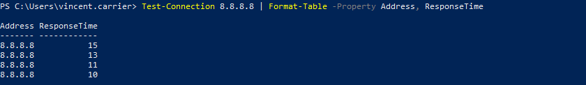

Ou encore, effectuer un calcul sur l'objet. Par exemple, calculer la somme des temps réponse de chacune des 4 tentatives de ping.

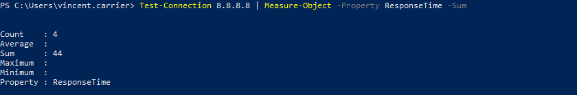

On peut aussi extraire une valeur spécifique.

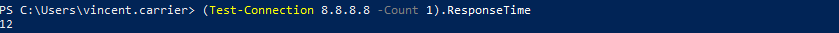

### Appellation d'une commande PowerShell

L'appellation d'une commande (cmdlet) est toujours définie sous la forme `Verbe-Nom`.

#### Le verbe (_verb_)

Le verbe décrit une action posée sur un certain élément accessible par le système d'exploitation.

| Verbe     | Description                                 |
| --------- | ------------------------------------------- |
| `Get`     | Obtenir de l'information                    |
| `Set`     | Écrire (remplacer) des données ou attributs |
| `New`     | Créer un nouvel objet                       |
| `Copy`    | Copier un objet                             |
| `Stop`    | Arrêter un objet                            |
| `Restart` | Redémarrer un objet                         |

#### Le nom (_noun_)

Le nom décrit un objet sur lequel l'action sera posée.

| Nom | Description |
| -- | -- |
| `Process` | Un ou plusieurs processus en cours d'exécution |
| `Service` | Un ou plusieurs services enregistrés par le gestionnaire de services de Windows |
| `Command` | Une commande PowerShell enregistrée |
| `Location` | Le répertoire courant |
| `Item` | Les éléments du provider (généralement, les fichiers et dossiers du système de fichiers) |
| `Computer` | L'ordinateur |
| `Help` | Les rubriques d'aide |

#### Exemples de commandes

Une commande sert à poser une action sur quelque chose. Son nom est donc la combinaison d'un verbe et d'un nom.

| Commande | Description |
| -- | -- |
| `Get-Process` | Obtient l'information sur un ou plusieurs processus en cours d'exécution |
| `Get-Item` | Obtient de l'information sur un élément  (fichier ou dossier) |
| `Get-ChildItem` | Obtient de l'information sur un ou plusieurs éléments enfant (fichier ou dossier, équivalent à la commande DIR ou LS) |
| `Copy-Item` | Copie un élément (fichier ou dossier) |
| `Stop-Service` | Arrête un service en cours d'exécution |
| `Start-Service` | Démarre un service enregistré |
| `Restart-Service` | Redémarre un service en cours d'exécution |
| `Set-Location` | Modifie le répertoire courant (équivalent à CD) |
| `New-LocalUser` | Crée un nouvel utilisateur local sous Windows |
| `Get-EventLog` | Obtient un ou plusieurs événements au journal de Windows |
| `Restart-Computer` | Redémarre un ordinateur (local ou distant) |

### Anatomie d'une commande

En plus de son nom, la commande doit admettre certaines informations en entrée, afin de bien décrire l'action qui doit être posée. On peut ainsi lui spécifier un certain nombre d'arguments.

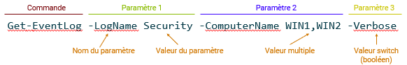

Les arguments viennent s'insérer dans les paramètres qui sont admis par la commande. Chaque commande comporte son jeu de paramètres, et chaque paramètre a un nom, qu'on identifie en les préfixant par un trait d'union. Il en existe plusieurs grands types:

- Les paramètres qui admettent une valeur
- Les paramètres qui admettent une ou plusieurs valeurs (séparées par des virgules)
- Les paramètres booléens, qu'on appelle switch, et qui activent une option lorsqu'on les spécifie

### Aide en ligne

PowerShell est généralement très bien documenté. Vous pouvez avoir accès à la [documentation officielle](https://docs.microsoft.com/fr-ca/powershell/?view=powershell-5.1) sur le site de Microsoft.

:::tip
J'ai habituellement plus de facilité à trouver ce que je cherche sur Google que sur le site de Microsoft. Il suffit de taper "_PowerShell Get-Quelquechose_" pour tomber pile sur la page en question. Assurez-vous toutefois de modifier la version de PowerShell pour celle que vous utilisez (par exemple, Windows PowerShell 5.1).
:::

#### Aide à la ligne de commande

En plus du site de Microsoft, PowerShell permet la consultation des rubriques d'aide directement à partir de la ligne de commande, à l'instar de la commande man sous Linux/UNIX. Sous PowerShell, la commande à utiliser est Get-Help.

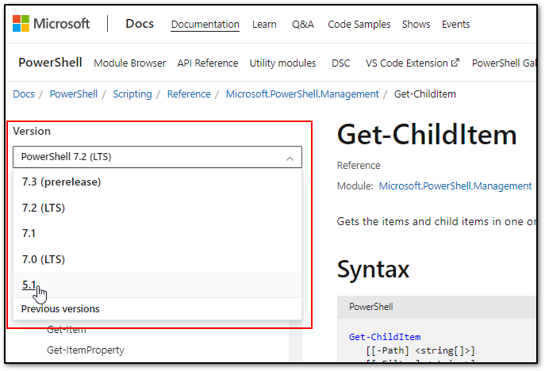

On peut obtenir une définition plus complète avec le switch -Detailed, ou des exemples d'utilisation avec -Examples. On peut aussi obtenir toute l'information disponible avec le switch -Full.

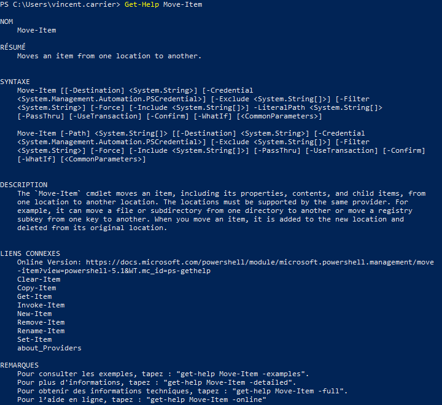

Vous pouvez obtenir de l'information détaillée sur un paramètre particulier avec le paramètre -Parameter.

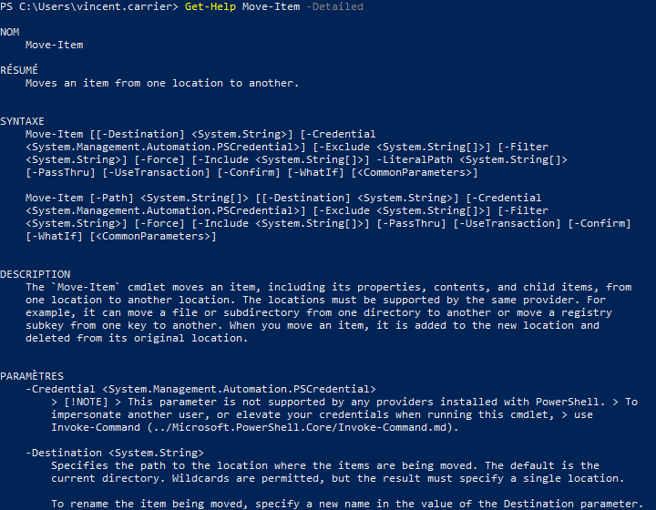

Il est possible d'afficher la rubrique d'aide dans une fenêtre séparée avec le switch -ShowWindow.

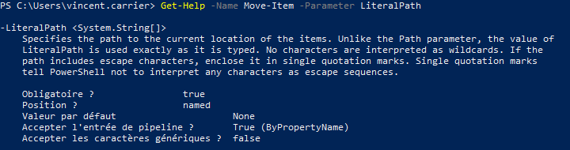

Finalement, vous pouvez simplement demander à ce que PowerShell ouvre la rubrique d'aide dans votre navigateur Web par défaut, à l'aide du switch -Online.

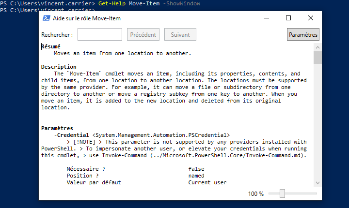

#### Mise à jour de l'aide

Pour pouvoir consulter les rubriques d'aide les plus récente, il faut procéder à la mise à jour de ces dernières. On peut le faire à l'aide de la commande Update-Help. Cette commande se connecte sur Internet pour obtenir la définition la plus à jour de la documentation pour chacun des modules installés sur le système. Notez que cette commande doit se faire avec des privilège d'admin local.

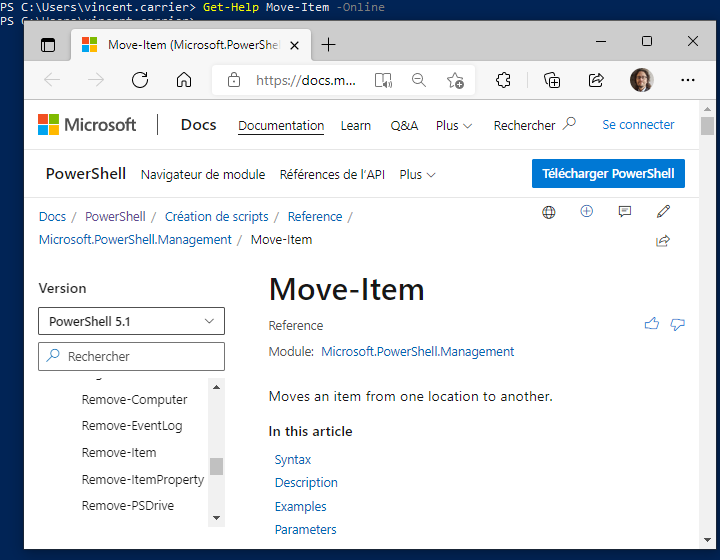

Il se peut qu'il y ait quelques erreurs affichées en rouge. Cela arrive parfois, car pour certaines (rares) commandes, les rubriques d'aide n'existent pas encore. 

#### Paramètres disponibles

Pour avoir la liste des paramètres disponibles, vous pouvez consulter l'aide… ou simplement écrire le nom de la commande, puis le trait d'union et appuyer sur la touche de tabulation pour alterner entre chaque paramètre disponible.

Vous pouvez aussi obtenir une liste de sélection des paramètres. Pour cela, il suffit d'écrire le nom de la commande, espace, trait d'union, et appuyer sur Ctrl+Espace pour afficher une liste dans la console. Naviguez dans la liste avec les flèches sur le clavier pour écrire le nom du paramètre. Remarquez qu'en bas de la liste, le type du paramètre est affiché.

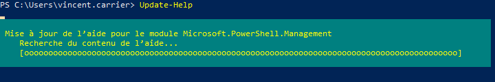

### Comprendre la documentation

Les détails des paramètres admis par une commande sont documentés en ligne sur le site de Microsoft. 

La section Syntaxe indique le sommaire de tous les paramètres utilisables.

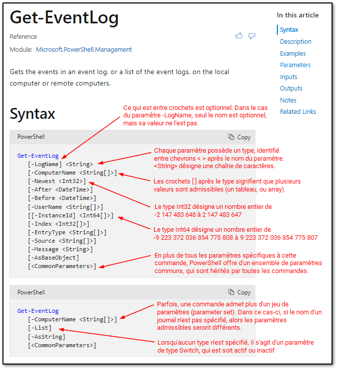

Source: [Get-EventLog (Microsoft.PowerShell.Management) - PowerShell | Microsoft Docs](https://docs.microsoft.com/en-us/powershell/module/microsoft.powershell.management/get-eventlog?view=powershell-5.1#syntax)

Plus loin dans l'article, on peut trouver la liste des paramètres, en ordre alphabétique. On y spécifie à quoi sert le paramètre, son type, sa position (dans le cas d'un paramètre positionnel), sa valeur par défaut, si ce paramètre peut être fourni par le pipeline, et si des caractères de types wildcard (* et ?) peuvent être spécifiés.

### Paramètres positionnels

Il est possible de spécifier des paramètres sans toujours identifier leur nom. C'est particulièrement pratique à la ligne de commande, pour sauver du temps et des frappes de touches.

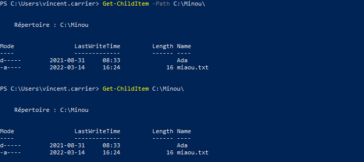

L'utilisation de paramètres positionnels nuit toutefois à la lisibilité, puisqu'il faut connaître par cœur ce que signifie la première position, la seconde, etc. 

Par exemple, lorsqu'on utilise la commande Copy-Item avec deux paramètres positionnels, le premier représente le chemin de la source et le second, le chemin de destination; bien que cet ordre soit intuitif et bien ancré dans nos réflexes, il faut néanmoins le connaître par cœur. En spécifiant les noms des paramètres, non seulement la signification de chaque argument est explicite, mais en plus, ils peuvent être disposés dans n'importe quel ordre.

Par exemple, `Copy-Item -Path C:\Minou\miaou.txt -Destination C:\Pitou\wouf.txt` a le même effet que `Copy-Item -Destination C:\Pitou\wouf.txt -Path C:\Minou\miaou.txt`

La signification des paramètres positionnels varie selon le type des valeurs qu'on spécifie, et sont documentés en ligne sur le site Web de Microsoft. La position 0 désigne le premier argument, la position 1 désigne le deuxième, et ainsi de suite.

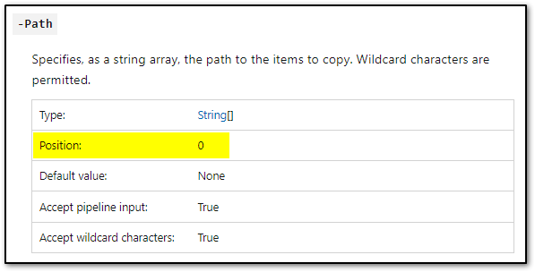

Source: [Copy-Item (Microsoft.PowerShell.Management) - PowerShell | Microsoft Docs](https://docs.microsoft.com/en-us/powershell/module/microsoft.powershell.management/copy-item?view=powershell-5.1#parameters)

Pour en savoir plus sur les paramètres: [à propos des paramètres - PowerShell | Microsoft Docs](https://docs.microsoft.com/fr-ca/powershell/module/microsoft.powershell.core/about/about_parameters?view=powershell-5.1)

### Commandes disponibles

Il y a un grand nombre de commandes disponibles dans PowerShell. Non seulement il y a les commandes qui font partie intégrante de la base de PowerShell, mais il est possible d'en enregistrer des nouvelles en installant des modules supplémentaires.

Il existe plusieurs manières d'obtenir la liste des commande disponibles.

#### `Get-Command`

La commande `Get-Command` retourne un objet qui énumère toutes les commandes disponibles dans la session PowerShell.

Attention, y'en a beaucoup!

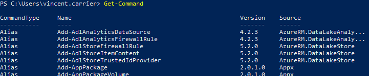

On peut savoir combien il y en a avec la commande Measure-Object. Cette commande sert à effectuer une analyse d'un objet, comme pour compter ses éléments (lorsqu'il s'agit d'une collection d'objets).

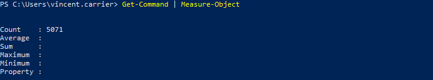

On peut rechercher toutes les commandes qui concernent un type d'objet en particulier, à l'aide du paramètre -Noun.

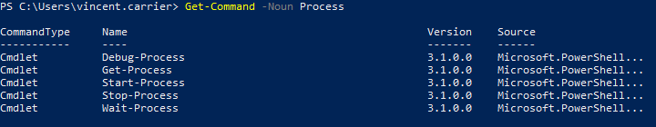

Ou encore, toutes les commandes qui font partie d'un module précis (dans cet exemple, le module Defender qui permet de contrôler l'anti-virus Microsoft Defender)

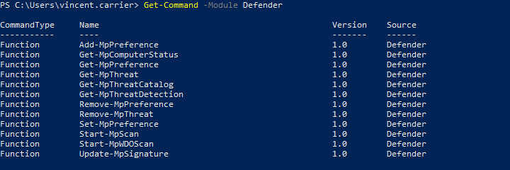

#### `Show-Command`

La commande `Show-Command` affiche à l'écran une interface graphique (GUI) pour vous aider à trouver une commande et à la construire avec tous ses paramètres.

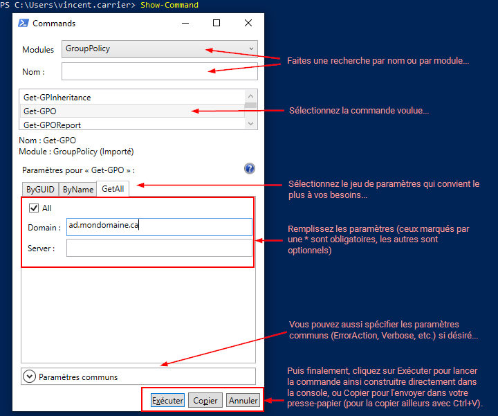

### Alias

La forme `Verbe-Nom` des commandes a l'avantage d'être explicite et claire, mais a aussi l'inconvénient d'être encombrante dans la ligne de commande. Pour pallier ce problème, PowerShell permet de substituer des alias aux commandes. Ces alias peuvent faire gagner du temps, par le nombre réduit de caractères à taper mais aussi en préservant nos réflexes provenant de la ligne de commande Windows ou Linux.

Par exemple, `Get-ChildItem` dispose de trois alias par défaut: `dir`, `ls` et `gci`. Utiliser ces trois commandes a le même effet que d'utiliser `Get-ChildItem`; on peut voir ça comme un raccourci.

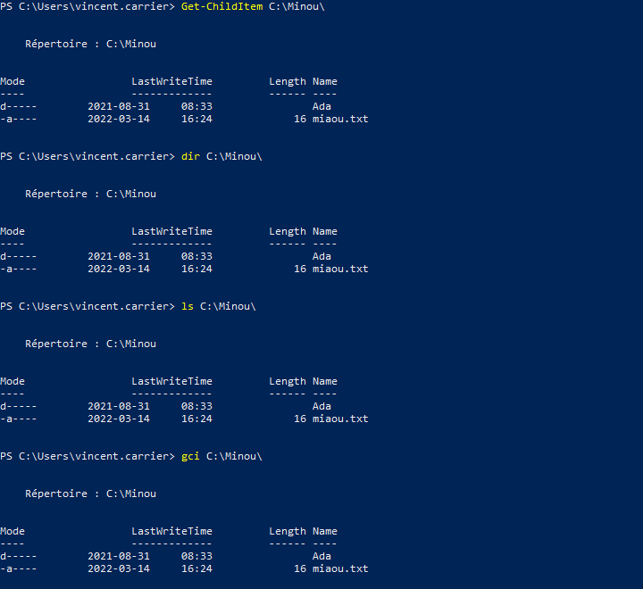

C'est bien pratique dans la ligne de commande, mais il est tout de même préférable d'utiliser le vrai nom de la commande dans un script, car cela aide à la compréhension du script.

Pour voir la liste des alias, il suffit de lancer la commande `Get-Alias`.

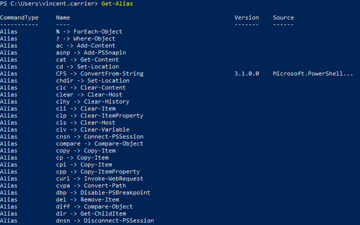

Pour créer un nouvel alias, la commande à utiliser est `New-Alias`. 

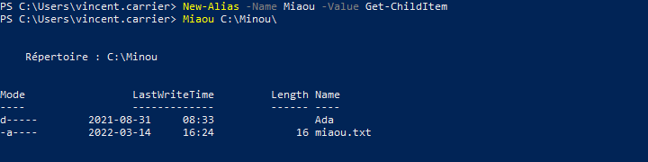

Il faut faire attention cependant, car cet alias sera détruit lorsque votre session PowerShell se terminera (soit en fermant la console, soit à la fin d'un script). Pour qu'un alias soit permanent, il faut le définir dans un profil. Vous pouvez lire cet article pour en apprendre plus au sujet des profils PowerShell: [à propos des profils - PowerShell | Microsoft Docs](https://docs.microsoft.com/fr-ca/powershell/module/microsoft.powershell.core/about/about_profiles?view=powershell-5.1)

## Commandes utiles

Voici quelques exemples de commandes fréquemment utilisées par les administrateurs de système. Ce n'est qu'un aperçu, car il en existe des centaines. Par ailleurs, vous verrez dans les prochains cours des techniques qui vous permettront de maximiser leur utilisation.

### Système de fichiers

`Get-Item` : Obtient de l'information sur un élément du système de fichiers.

`Get-ChildItem` : Obtient de l'information sur le contenu du répertoire courant.

`Get-ChildItem -Path "C:\Windows"` : Obtient la liste des éléments contenus dans le répertoire _C:\Windows_.

`Get-ChildItem -Recurse` : Obtient la liste des éléments contenus dans le répertoire courant et tous ses sous-répertoires.

`Get-ChildItem -Path "C:\Windows\w*.exe"` : Obtient la liste des éléments dans _C:\Windows_ qui commencent par "_w_" et se terminent par "_.exe_". Le paramètre `-Path` est implicite.

`Get-ChildItem -Directory` : Obtient la liste des *répertoires* contenus dans le répertoire courant.

`Get-ChildItem -File` : Obtient la liste des *fichiers* contenus dans le répertoire courant.

`New-Item "Minou.txt"` : Crée un nouveau fichier vide nommé _Minou.txt_ dans le répertoire courant. Le paramètre `-Path` est implicite.

`New-Item -Path "Minou" -ItemType Directory` : Crée un nouveau dossier nommé _Minou_ dans le répertoire courant.

`New-Item "C:\Temp\Minou.txt"` : Crée un nouveau fichier vide nommé Minou.txt dans le répertoire _C:\Temp_. Le paramètre `-Path` est implicite.

`Remove-Item "C:\Temp\Minou.txt"` : Supprime le fichier _C:\Temp\Minou.txt_. Le paramètre `-Path` est implicite.

`Copy-Item "C:\Temp\Minou.txt" "C:\Temp2\Minou2.txt` : Copie le fichier _C:\Temp\Minou.txt_ vers _C:\Temp2\Minou2.txt_. Les paramètres `-Path` et `-Destination` sont implicites.

`Move-Item "C:\Temp\Minou.txt" "C:\Temp2\Minou2.txt` : Déplace le fichier _C:\Temp\Minou.txt_ vers _C:\Temp2\Minou2.txt_. Les paramètres `-Path` et `-Destination` sont implicites.

`Set-Location "C:\Windows"` : Modifie le répertoire de travail vers _C:\Windows_. Le paramètre `-Path` est implicite.

`Push-Location "C:\Windows"` : Modifie le répertoire de travail vers _C:\Windows_ en gardant en mémoire l'emplacement courant. Le paramètre `-Path` est implicite.

`Pop-Location` : Rétablit le répertoire de travail précédent (celui d'avant le dernier appel de `Push-Location`)

`Get-Content "C:\Windows\System32\drivers\etc\HOSTS"` : Affiche le contenu du fichier HOSTS dans la console.

### Gestion des services

Les services sont des logiciels gérés par Windows qui sont exécutés en arrière-plan et bénificient d'accès privilégiés sur le système. Par l'interface graphique, on peut administrer les services à travers la console MMC du gestionnaire de services (services.msc, compmgmt.msc, etc.) ou par le gestionnaire des tâches (taskmgr.exe). Par la ligne de commande classique, ils peuvent être contrôlés par les commandes NET (contrôle de base) ou SC (contrôle avancé). Voici des exemples de commandes PowerShell pour les manipuler:

`Get-Service` : Obtient la liste des services installés sur le système.

`Get-Service -Name "spooler"` : Obtient l'information sur le service "spooler". Le nom du paramètre `-Name` peut être omis.

`Get-Service "s*"` : Obtient la liste des services dont le nom commence par "_s_". Le paramètre `-Name` est implicite.

`Start-Service -Name "spooler"` : Démarre le service "spooler".

`Stop-Service "spooler"` : Arrête le service "spooler". Le paramètre `-Name` est implicite.

`Restart-Service -Name "spooler"` : Arrête puis démarre le service "spooler" en une seule opération.

`Set-Service -Name "spooler" -StartupType Disabled` : Désactive le service "spooler" (il ne pourra plus démarrer).

### Gestion des processus

Les processus sont des objets logiques servant à attribuer des ressources système à un programme (mémoire, temps de processeur, contexte de sécurité, etc.) afin qu'il puisse s'exécuter. Chaque fois qu'un fichier exécutable est lancé, un processus est créé à son image. Chaque processus dispose d'un identifiant numérique, le PID. Lorsque le programme a terminé son exécution, le processus "meurt" et est détruit, ce qui libère les ressources qui lui étaient réservées. Il est possible d'obtenir de l'information sur les processus en cours d'exécution ou les terminer de force par l'interface graphique à travers le gestionnaire des tâches (taskmgr.exe), ou par la ligne de commande classique au moyen des utilitaires TASKLIST et TASKKILL. Voici des examples de commandes PowerShell permettant de manipuler les processus:

`Get-Process` : Obtient la liste des processus en cours d'exécution sur le système.

`Get-Process 123` : Obtient de l'information sur le processus dont le PID est 123.

`Get-Process -Name "notepad"` : Obtient la liste des processus en cours d'exécution sur le système dont l'image est "notepad". On ne peut pas omettre le nom du paramètre `-Name`, car le paramètre positionnel à la position 0 est `-Id`.

`Start-Process "notepad.exe"` : Démarre une instance de notepad.exe. Le paramètre `-FilePath` est implicite.

`Start-Process -FilePath "notepad.exe" -ArgumentList "C:\Windows\System32\Drivers\etc\hosts" -Verb RunAs` : Ouvre le fichier HOSTS dans Notepad avec des privilèges administrateur.

`Stop-Process -Id 123` : Termine (tue) le processus numéro 123. Cette commande échoue s'il n'y a pas de processus à ce numéro. Le paramètre `-Id` peut être omis.

`Stop-Process -Name "notepad"` : Termine tous les processus qui s'appellent notepad.

### Gestion du stockage

`Get-Volume` : Obtient de l'information sur les volumes de stockage (disque dur, clé USB, etc.) accessibles à Windows.

`Get-Partition` : Obtient de l'information sur les partitions des disques durs et médiums physiques de stockage installés sur le système.

`Get-Disk` : Obtient de l'information sur les périphériques de stockage matériels installés sur le système.

### Gestion des utilisateurs et groupes locaux

`Get-LocalUser` : Obtient la liste des utilisateurs locaux du système.

`Get-LocalGroup` : Obtient la liste des groupes locaux du système.

`Get-LocalGroupMember -Group Administrateurs` : Obtient la liste des membres du groupe local Administrateurs.

`Get-LocalGroupMember -SID "S-1-5-32-544"` : Obtient la liste des membres du groupe local Administrateurs peu importe la langue du système.

### Configuration réseau

`Get-NetAdapter` : Obtient la liste des adapteurs réseau installés (physiques ou virtuels).

`Get-NetAdapter -Physical` : Obtient la liste des adapteurs réseau installés (physiques seulement).

`Get-NetAdapterHardwareInfo` : Obtient la liste des adapteurs réseau matérielles et des informations sur leur connexion physique à l'ordinateur.

`Get-NetIPInterface` : Obtient la liste des interfaces réseau

`Get-NetIPAddress` : Obtient la liste des adresses IP

`Get-NetIPAddress -AddressFamily IPv4` : Obtient la liste des adresses IPv4

`Get-NetIPInterface` : Obtient la liste des interfaces réseau

`New-NetIPAddress –IPAddress 192.168.1.10 -DefaultGateway 192.168.1.1 -PrefixLength 24 -InterfaceIndex 5` : Définit la configuration IP sur l'interface réseau 5.

`Set-DNSClientServerAddress –InterfaceIndex 5 –ServerAddresses 192.168.1.10` : Définit 192.168.1.10 comme résolveur DNS sur l'interface réseau 5.

### Autres commandes

`Get-EventLog -LogName Application -Newest 20` : Obtient la liste des 20 derniers événements du journal Application (dans l'observateur d'événements)

`Get-Date` : Obtient la date et l'heure dans le format localisé du système

`Get-Date -Format "yyyy-MM-dd"` : Obtient la date en format ISO 8601. Vous pouvez consulter [l'article concernant les formats de date](https://learn.microsoft.com/fr-ca/dotnet/standard/base-types/custom-date-and-time-format-strings?view=netframework-4.8) du framework .NET sur le site de Microsoft.

`Get-Date -UFormat "%Y-%m-%d"` : Obtient la date en format ISO 8601. Le résultat est le même que dans l'exemple précédent, mais utilise la notation UNIX au lieu de la notation .NET. Vous pouvez [consulter la documentation](https://learn.microsoft.com/en-us/powershell/module/microsoft.powershell.utility/get-date?view=powershell-5.1#notes) pour en savoir plus.

`Invoke-Item -Path C:\Temp\MonDocument.docx` : Ouvre le fichier spécifié dans le logiciel par défaut traitant ce type de fichier (dans ce cas, Microsoft Word).

`Test-NetConnection -ComputerName "10.10.7.110" -Port 3000` : Teste la connectivité au port 3000/tcp sur la machine 10.10.7.110.

`Restart-Computer` : Redémarre l'ordinateur

`Rename-Computer -NewName "MIAOUMIAOU" -Restart` : Renomme l'ordinateur et redémarre automatiquement

`Install-WindowsFeature -Name "AD-Domain-Services" -IncludeManagementTools` : Installe le rôle Active Directory Domain Services sur Windows Server avec ses outils de gestion.

`Install-ADDSForest -DomainName "ad.minou.net" -DomainNetBIOSName "MINOU" -InstallDNS` : Effectue la promotion du serveur comme premier contrôleur de domaine de sa forêt et installe automatiquement le serveur DNS.

`Add-Computer -DomainName "ad.minou.net" -Restart` : Effectue la jonction du système au domaine ad.minou.net et redémarre automatiquement.

`Add-Computer -DomainName "ad.minou.net" -OUPath "OU=Postes de travail,DC=ad,DC=minou,DC=net"` : Effectue la jonction du système au domaine ad.minou.net et crée le compte utilisateur dans l'OU _Postes de travail_ plutôt que dans le conteneur _computer_ par défaut.

`Install-Module -Name "AdsiPS"` : Installe le module AdsiPS à partir du dépôt PowerShell Gallery.

`Get-Command -Module AdsiPS` : Liste toutes les commandes offertes par le module AdsiPS
