import Tabs from '@theme/Tabs';
import TabItem from '@theme/TabItem';

# Rencontre 3 - Collections et types

:::note Résumé de la séance

<Tabs>

<TabItem value="deroulement" label="👨‍🏫 Déroulement du cours">

1. Rappel du cours précédent
1. Variables et types de données
1. Collections et tableaux

</TabItem>

<TabItem value="exercices" label="💻 Exercices à compléter">

Les exercices suivants se trouvent dans votre section personnelle du bloc-notes du cours, sous l'onglet *Exercices*:
- Exercice 03: Collections

</TabItem>

<TabItem value="ressources" label="📚 Ressources à consulter">

La présentation PowerPoint est sur le Teams du cours, sous le canal Général > Fichiers > Supports de cours.

</TabItem>

</Tabs>

:::

## Types de données

Tout objet en PowerShell possède un type, et s'il est dans une variable, celle-ci possède également ce type. Il existe plusieurs types distincts.

### Nombres entiers

| Type | Description | Valeur minimale | Valeur maximale |
| -- | -- | -- | -- |
| `[byte]` | Entier non signé de 8 bits | 0 | 255 | 
| `[sbyte]` | Entier signé de 8 bits | -128 | 127 |
| `[int16]` | Entier signé de 16 bits | -32 768 | 32 767 |
| `[uint16]` | Entier non signé de 16 bits | 0 | 65 535 |
| `[int32]` _ou_ `[int]` |Entier signé de 32 bits | -2 147 483 648 | 2 147 483 647 |
| `[uint32]` | Entier non signé de 32 bits | 0 | 4 294 967 295 |
| `[int64]` _ou_ `[long]` | Entier signé de 64 bits | -9 223 372 036 854 775 808 | 9 223 372 036 854 775 807 |
| `[uint64]` | Entier non signé de 64 bits | 0 | 18 446 744 073 709 551 615 |

:::info
Par défaut, les nombres entiers sont de type `[int32]` (ou `[int64]` s'il sont trop grands). Pour qu'ils soient de type différent, il faut le spécifier devant la valeur. (Par exemple, `[uint32]42`).
:::

### Nombre à virgule flottante (décimaux)

| Type | Description | Précision | Valeur minimale/maximale |
| -- | -- | -- | -- |
| `[single]` _ou_ `[float]` | Nombre à virgule flottante de précision simple | 32 bits | ± 3,402 823 E+38 |
| `[double]` | Nombre à virgule flottante de précision double (par défaut) | 64 bits | ± 1,79 769 313 486 232 E+308 |
| `[decimal]` | Nombre décimal | 128 bits | ± 79 228 162 514 264 337 593 543 950 335 |

:::info
Par défaut, les nombres non entiers sont de type `[double]`. Pour qu'ils soient d'un autre type, il faut le spécifier devant la valeur (par exemple, `[single] 3.14`).

Les nombres à virgule flottante sont la méthode qu'emploient les ordinateurs pour représenter les nombres non entiers. Ils combinent une mantisse et un exposant, comme dans la notation scientifique, ce qui permet de représenter de très grands nombres mais en sacrifiant de la précision. Vous pouvez suivre ce lien pour en apprendre davantage sur la virgule flottante en informatique. 
:::

### Autres types de données

| Type | Description | Example |
| -- | -- | -- |
| `[boolean]` _ou_ `[bool]` | Valeur booléenne (`$true` ou `$false`) | `$true` |
| `[string]` | Chaîne de caractères à taille fixe | `"allo"` |
| `[char]` | Caractère unicode de 16 bits | `[char]"X"` |
| `[datetime]` | Date et heure | `Get-Date` | 
| `[hashtable]` | Table de hachage | `@{a = 1; b = 2; c = 3}` |
| `[pscustomobject]` | Objet dictionnaire | `[pscustomobject]@{a = 1; b = 2; c = 3}` |
| `[object]` | Type qui décrit n'importe quel objet (toutes les classes dérivent de `[object]`) |  |
| `[array]` _ou_ `[type[]]` | Tableau (contient plusieurs objets, dans un ordre précis) | `@(1, 2, 3)` |
| `[scriptblock]` | Bloc de script précompilé | `$script = [scriptblock]{ # une ou plusieurs commandes… }` |
| `[math]` | Expose des fonctions mathématiques | `[math]::Pow(10,2)` |

Pour en savoir plus sur les types de données PowerShell, consultez [cette page](https://learn.microsoft.com/fr-fr/powershell/scripting/lang-spec/chapter-04?view=powershell-5.1).

### Valeurs minimum et maximum

Toute donnée est un objet, et un objet possède un type. Dans le paradigme orienté objet, un type est une classe, et un objet de ce type est une instance de cette classe. Les classes sont en quelque sorte des plans, ou modèles, qui dictent à quoi une donnée doit ressembler. Une classe est représentée entre crochets `[` et `]`. 

La classe elle-même expose des méthodes et des attributs, dits statiques, qui décrivent certains aspects de ce type. Alors qu'on peut accéder aux méthodes et attributs d'un objet (ou instance de classe) avec un point `.` , on accède les méthodes et attributs d'une classe avec un double deux points `::`.

Dans le cas des types numériques, des attributs de la classe correspondant au type nous permettent d'obtenir les valeurs minimum et maximum que ce type supporte.

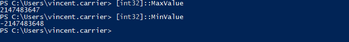

### Conversion de types

On peut convertir les valeurs d'un type à l'autre, et les castant, c’est-à-dire en forçant le type.

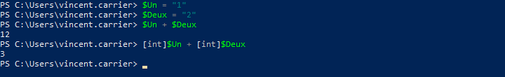

Il faut toutefois faire attention que la valeur soit compatible avec le type vers lequel on souhaite la convertir.

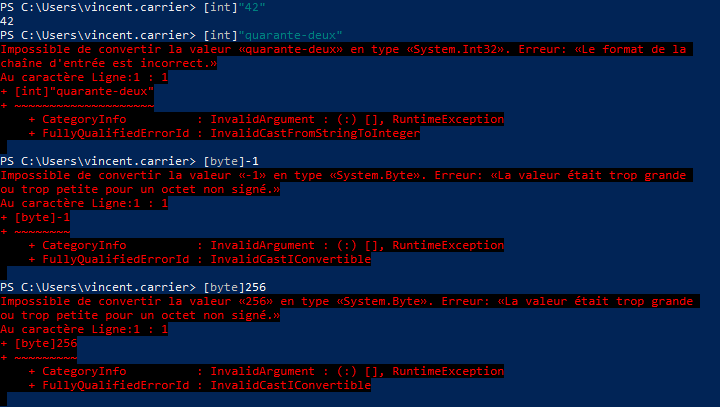

### Suffixes de multiplication des octets

PowerShell nous offre un moyen de calculer facilement les grandeurs (Ko, Mo, Go, etc.)

| Suffixe | Signification | Valeur |
| -- | -- | -- |
| Kb | Kibioctet | 210 = 1024 | 
| Mb | Mébioctet | 220 = 10242 = 1 048 576 | 
| Gb | Gibioctet | 230 = 10243 = 1 073 741 824 |
| Tb | Tébioctet | 240 = 10244 = 1 099 511 627 776 |
| Pb | Pébioctet | 250 = 10245 = 1 125 899 906 842 624 |

Cela peut s'avérer très pratique pour, par exemple, calculer les tailles de fichiers.

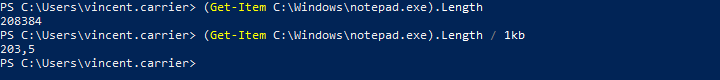

### Chaînes de caractères

Les chaînes de caractères sont un type de données particulièrement commun dans tous les langages de programmation, et PowerShell ne fait pas exception.

#### Guillemets

En PowerShell, les chaînes de caractères sont balisées par des guillemets. Les guillemets simples et doubles sont acceptés.

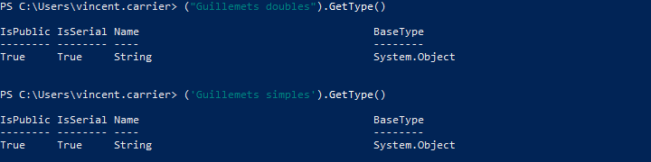

Un type de guillemet compris dans une chaîne balisée par l'autre type de guillemets sera affiché tel quel.

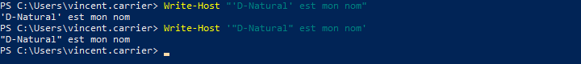

Par contre, les deux types de guillemets se comportent différemment avec les variables. Le variables écrites dans une chaîne à guillemets doubles sont résolues, alors que celles dans une chaîne à guillemets simples ne le sont pas.

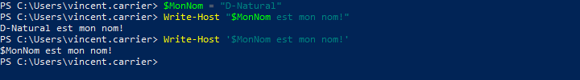

Pour écrire à la fois des guillemets doubles dans une chaîne et résoudre une variable, on peut soit doubler les guillemets doubles (un double-double-guillemet représente le caractère du double-guillemet), ou encore mettre un caractère d'échappement (le backtick) juste avant pour le forcer à être représenté comme caractère dans la chaîne.

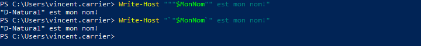

Pour les cas plus complexes, on peut construire une variable temporaire au sein d'une chaîne de caractères, avec la formule $(). C'est pratique si on veut non pas résoudre une variable dans une chaîne, mais plutôt résoudre une expression.

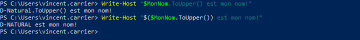

De cette manière, on peut résoudre n'importe quelle expression au sein de la chaîne de caractères.

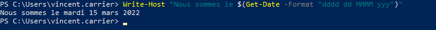

#### Concaténation

On peut aussi concaténer deux chaînes de caractères avec l'opérateur de concaténation `+`.

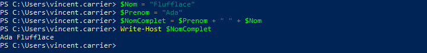

Une autre option pour unir plusieurs éléments d'une chaîne est d'utiliser l'opérateur de formatage `-f`. On écrit la chaîne de caractères mais en y insérant des jetons {n}. Ceux-ci seront remplacés par le contenu des variables spécifiées après l'opérateur `-f`.

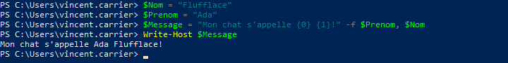

Ou encore, on peut toujours insérer les variables directement dans la chaîne, lorsqu'on utilise des guillemets doubles.

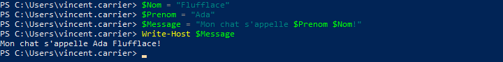

### Opérateurs

#### Opérateurs arithmétiques

| Opérateur | Description |
| -- | -- |
| `+` | Addition |
| `-` | Soustraction |
| `*` | Multiplication |
| `/` | Division |
| `%` | Modulo |

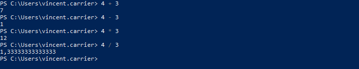

L'opérateur modulo sert à donner le reste de la division entière. En PowerShell, c'est le caractère `%` qui désigne cet opérateur. Pour la division entière par contre, PowerShell n'offre pas d'opérateur, à la différence de plusieurs autres langages. L'opérateur `/` produit une valeur de type `[double]` si le résultat n'est pas un nombre entier, et caster le résultat à `[int]` arrondit ce résultat à l'entier le plus proche. Par conséquent, la composante entière de la division peut être obtenue en appelant la fonction plancher de la classe utilitaire Math.

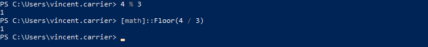

#### Opérateurs de comparaison

Les opérateurs de comparaison retournent une valeur booléenne vraie ou fausse dans le pipeline, selon un critère précis. On les utilise entre deux valeurs.

| Opérateur | Description | Exemple |
| -- | -- | -- |
| `-eq` | Égal à | `0 -eq 0` |
| `-ne` | Pas égal à | `0 -ne "allo"` |
| `-gt` | Plus grand que | `1 -gt 0` |
| `-ge` | Plus grand ou égal à | `0 -ge 0` |
| `-lt` | Plus petit que | `-1 -lt 0` |
| `-le` | Plus petit ou égal à | `0 -le 0` |
| `-like` | Comparaison avec wildcard | `"allo" -like "a*"` |
| `-notlike` | Inverse de `-like` | `"bonjour" -notlike "a*"` |
| `-match` | Comparaison regex | `"514-555-0123" -match "\d{3}-\d{3}-\d{4}"` |
| `-nomatch` | Inverse de `-match` | `"(514) 555-0123" -match "\d{3}-\d{3}-\d{4}"` |
| `-is` | Comparaison de type | `1.1 -is [double]` |
| `-isnot` | Inverse de `-is` | `1 -isnot [double]` |
| `-and` | Et logique | `(0 -eq 0) -and ("pomme" -eq "pomme")` |
| `-or` | Ou logique | `(0 -eq 0) -or ("pomme" -eq "banane")` |
| `-not` _ou_ `!` | Non logique | `-not (1 -eq 0)`   `!(1 -eq 0)` |
| `-xor` | Ou exclusif | `$true -xor $false` |

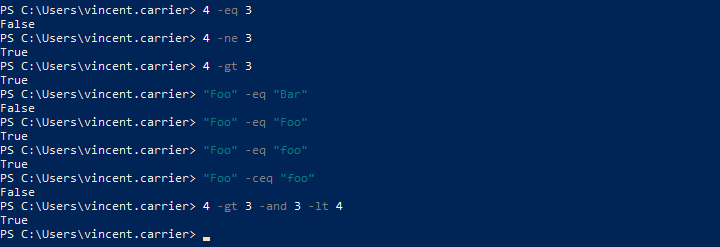

#### Opérateurs d'affectation

Les opérateurs d'affectation modifient l'opérande de gauche.

| Opérateur	Description | Exemple | Équivalent |
| -- | -- | -- |
| `=` | Affectation simple | `$i = 2` |  |
| `+=` | Affectation après addition | `$i += 2` | `$i = $i + 2` |
| `-=` | Affectation après soustraction | `$i -= 2` | `$i = $i - 2` |
| `*=` | Affectation après multiplication | `$i *= 2` | `$i = $i * 2` |
| `/=` | Affectation après division | `$i /= 2` | `$i = $i / 2` |
| `%=` | Affectation après modulo | `$i %= 2` | `$i = $i % 2` |
| `++` | Incrémentation | `$i++` | `$i = $i + 1` |
| `--` | Décrémentation | `$i--` | `$i = $i - 1` |

## Collections et tableaux

Les commandes PowerShell retournent souvent non pas un objet, mais plusieurs objets dans le pipeline. Par exemple, il est fréquent que la commande `Get-ChildItem` retourne plus d'un objet, car il y a généralement plusieurs fichiers et dossiers dans un dossier.

### Compter les objets d'une collection

On peut connaître le nombre d'éléments retournés par une commande à l'aide de la commande `Measure-Object`.

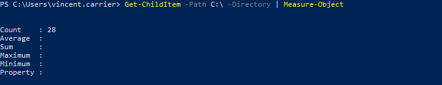

Et comme plusieurs objets mis ensemble constituent une collection d'objets, et que cette collection est également un objet, on peut aussi lire l'attribut `.Length` de cette collection.

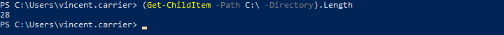

### Accéder à un élément précis

Une collection dans PowerShell est une liste d'objet, qu'on appelle aussi Tableau ou Array, et qui est composé de plusieurs valeurs dans un ordre précis. Chaque élément occupe une position: le premier a la position 0, le deuxième 1, et ainsi de suite. Ces nombre s'appelle un indice (index). On peut obtenir l'élément correspondant en spécifiant l'indice voulu entre crochets.

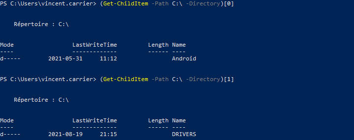

### Créer un tableau

Un tableau vide est créé avec la formule `@()`. Pour initialiser un nouveau tableau, donc, il suffit d'affecter le tableau vide à une variable. On peut ensuit lui ajouter des éléments, avec un opérateur d'affectation.

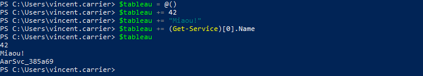

Un tableau peut comprendre plusieurs éléments de types différents, mais habituellement, on il est plus logique d'y retrouver des éléments du même type.

On peut affecter directement des valeurs à la création d'un tableau. Dans ce cas, on n'est pas obligé de respecter la syntaxe `@(…)`; elle est implicite. 

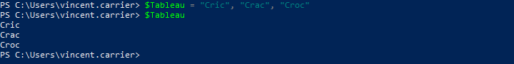

On peut aussi utiliser un raccourci pour créer rapidement un tableau d'entiers.

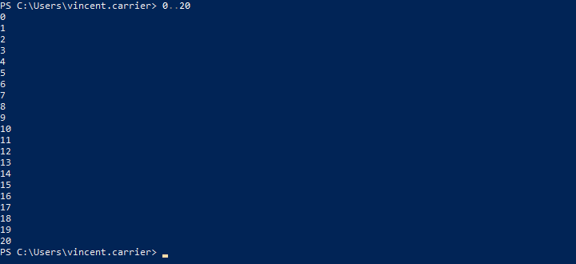

### Sélectionner des éléments

Lorsqu'on a un tableau d'objet qui circule dans le pipeline, on peut vouloir manipuler ce tableau pour en ressortir certains éléments et pas d'autres.

#### Sélection des indices

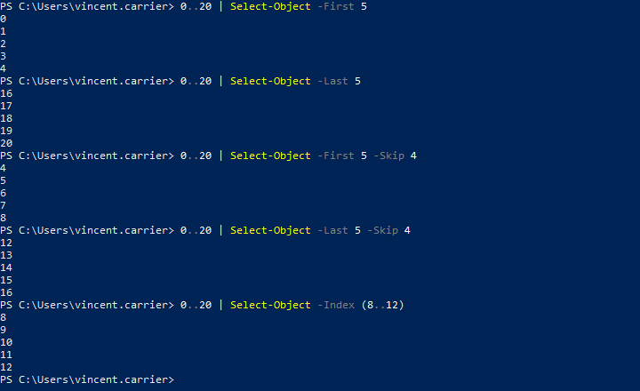

#### Sélection conditionnelle

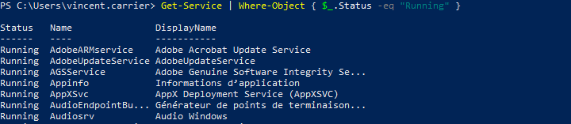

Ou…

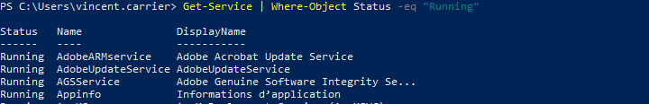

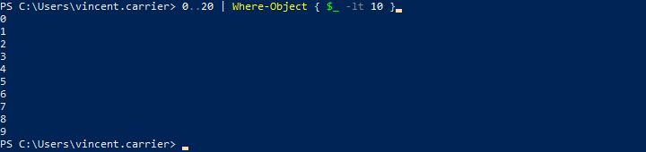

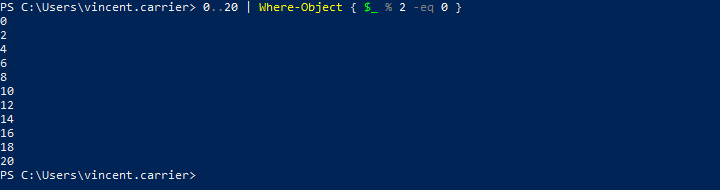

### Opérations sur un tableau

#### Opérateur -Contains

Pour tester si un tableau contient une valeur spécifique, on peut utiliser l'opérateur `-Contains`.

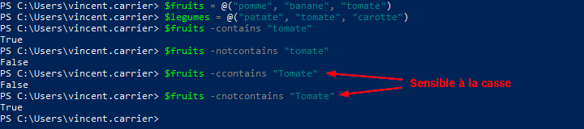

#### Concaténation

Donne tous les objets des deux collections (fusionne deux collections bout à bout)

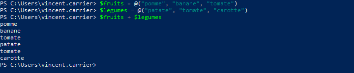

#### Union

Donne tous les objets de deux collections, mais sans doublons.

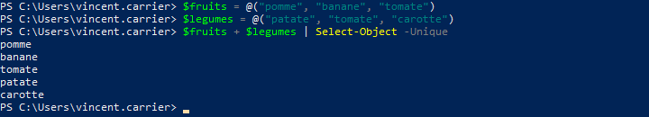

#### Intersection

Donne tous les objets qui ont à la fois dans deux collections

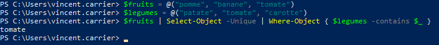

#### Différence

Retourne une collection moins tous les éléments semblables d'une deuxième collection

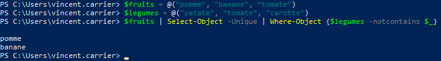

#### Tri

On peut trier une collection à l'aide de la commande `Sort-Object`, par ordre croissant ou décroissant.

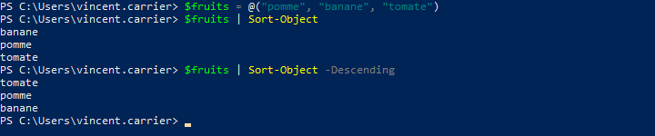

Par défaut, le tri s'effectue sur le nom d'affichage, mais il est possible de spécifier sur quelle propriété devra s'effectuer le tri.

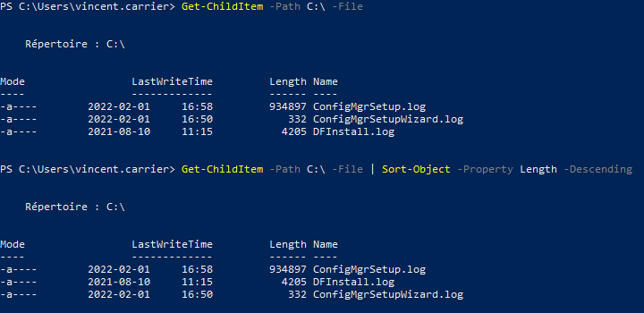

